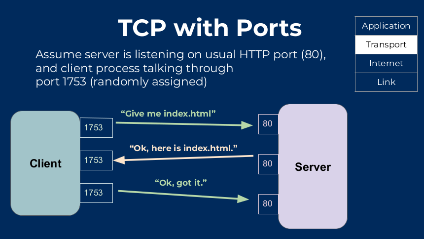

# Communication and Protocols

## Network 4-layer Model

>   This is a layered server architecture system in which each layer is defined according
    to a specific function to perform. All four layers work collaboratively to transmit data
    from one layer to another

* For computers to communicate with each other they need:
* A method of communication between them(a language, a set of rules)
* Need an efficient multi-step system, since it is quite complicated:
    1. Application Layer(HTTP,FTP,SSH,SMTP,POP3).
        *   Allows access to network resources 
        *   This is the layer at which applications live. Applications like a web browser
            directly interact with the Application layer. Web browsers use `http/s` if you're visiting a website, or `smtp` if you're checking your mail.
    3. Transport layer(**TCP**,UDP)
       * UDP is faster
    4. Internet Layer(**IP**)
    5. Link Layer(Ethernet, Wifi)

> It starts from the bottom, and moves up, so first you go through the Link Layer, then through the Internet Layer, then through the Transport Layer, and lastly through Application Layer.

## Flow

*   **Application layer**: Gets the data from whatever program you're using, and sends it to the transport layer through a specific port(each port can be assigned to a specific protocol). E.G most activity in web
    browser goes through port 80, which is what HTTP always uses.
*   **Transport Layer**: Gets the data from the application layer through a port, chops it up into packets, and
    then sends them. Each packet individually takes the quickest route to get to where it needs to be. Provides data transport from a process on a client to a process on a destination system(server)
*   Once packets are assembled, and TCP ensures they're error free, packets are pushed on the Internet layer.
*   **Internet Layer**: Attaches Origin and Destination IP address so packet knows where it's going, and where it came from
*   **Network Layer**: Sends to the machine on the correct machine on a physical network.

## Application Layer

*   Example: Web browsers need a protocol to get and send data
*   Provides applications with standardized **protocols** to exchange data when they're accessing
network resources: Protocols include: HTTP, FTP, SSH, SMTP, POP3
*   Programs like web browser directly interact with the Application layer. This layer has
    protocols like http/s if you're visiting websites or smtp if you're checking your email.]
### Uses

*   Helps identify communication partners, determining resource availability, synchronizing communication
*   Allows users to log on to a remote host
*   Provides various e-mail services

## Transport layer(TCP)

*   <mark>Helps ensure that data units are delivered error-free and in the right sequence.
</mark>
*   <mark>Controls the reliability of a link through flow control, error control, segmentation or de-segmentation.</mark>
*   TCP puts a header on each packet which contains instruction on the order in which to assemble
the packets. Contains error checking information so receiver knows if packet has been corrupted.
*   <mark>Offers an acknowledgement of successful data transmission and sends the next data in case no error occured. TCP is the best-known example of the transport layer.</mark>
*   Bi-directional: both client and server acknowledge when they get the data
*   Consists of a 3-way handshake:
    *   Client and server can send each other data, and must **acknowledge** when they receive
        something.
    *   If no acknowledgement that packet was received, packet is sent again.
    *   <mark>TCP is reliable, because it reacts to losing packets(which slows connection)</mark>
    *   <mark>UDP is **not** reliable, but doesn't react to packet loss(which is what makes it faster)</mark>
## Internet layer(IP)

*   Once packets are assembled, and TCP ensures they're error free, packets are pushed on the Internet layer.
*   Attaches Origin and Destination IP address so packet knows where it's going, and where it came from
*   Data then sent to network layer

## Network Layer

*   Takes care of MAC addressing so data goes to the right physical machine on a network

## Client-server + TCP/IP

* Client initiates request to server
* Server accepts or rejects the connection
* If a connection is established, data can flow until the connection terminates
* **TCP/IP facilitates connections between client and server over many networks, i.e THE INTERNET**
* Data is transported through TCP + IP, which enables the client-server interaction

