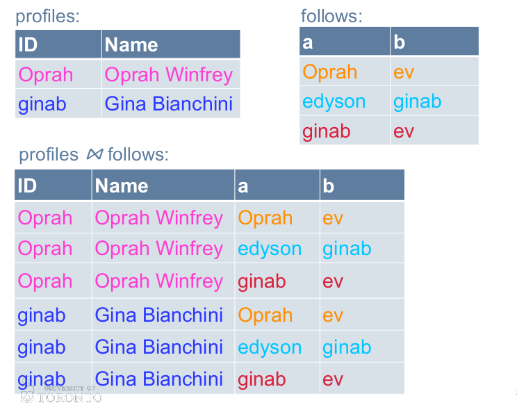
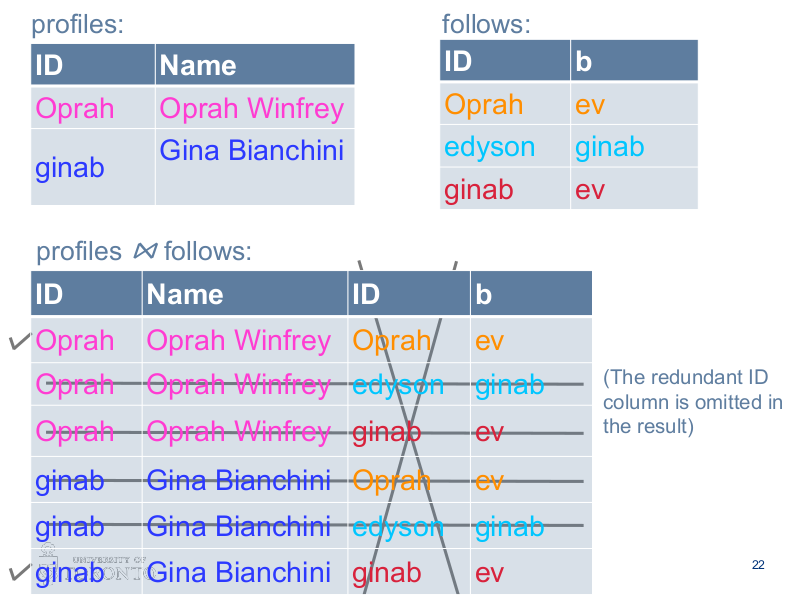
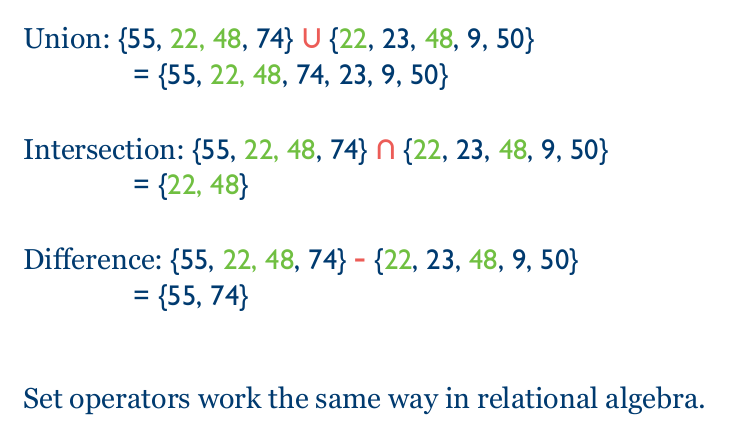

# Relational Algebra

## Definitions

**Relation**: table in SQL

**Schema**: structure of a relation(what columns does it have, what type are they, are there any constraints on its columns). e.g of schema: **Teams**(name, homefield, coach)

**Instance**: particular data in a relation. Instances frequently change, schemas always never.

**Tuple**: 1 row inside the relation. A row can have this format: {Nick, 21, UofT, CS}, where the attributes(*see below*)  are {surname, age, university, degree}.

**Attribute**: column in SQL. Attribute of a relation. Every Every tuple must have a value for that in RA(relational algebra). This is not necessarily true for SQL.

**Database schema**: a set of relation schemas

**Database instance**: a set of relation instances

<mark>All Relations are **sets**</mark>**. A relation is a **set** of tuples, which means:

* There can be **no duplicate tuples**

* Since it's a set, the **order of the tuples doesn't matter**.

> SQL is different since there, relations are **bags**(they allow duplicates. this will come later.)

## Constraining the data

**Superkeys**

* **Superkey** is a **set** of attributes(1+) that uniquely identify a tuple in a relation/table

* **key** is a <u>minimal</u> superkey. 

**Foreign keys**

* An <u>attribute</u> is a foreign key because it **refers to an attribute that is a key in another table**.
* If a key in another table has multiple attributes, then foreign key must also have attributes(since it must contain all attributes of the primary key).
* $R_1[X] \subseteq R_2[Y]$, e.g: $Roles[mID] \subseteq Movies[mID]$
  * X and Y are a list of attributes, **of same arity**
  * Y must be a key in $R_2$: notice that it is a key, not the superkey(we want the minimal set of attributes that uniquely identify a tuple)

> Note: $R_1[X] \subseteq R_2[Y]$ is a foreign key ifff Y is a key for relation $R_2$. Otherwise, it's a normal referential integrity constraint, or inclusion dependency. e.g $Artists[mID] \subseteq Roles[mID]$ If here mID in Roles is not a key, then we can have multiple mID's in Roles in which case this is not a Foreign key constraint.

> $R \subseteq S$  is equivalent to $ R - S = \emptyset$ , which essentially means that there is nothing in R that does not exist in S since (R - S only keeps the things that exist in R that do not exist in S).

---

## Relational Algebra Basics

Assume following schema for our examples:

**Exercise Schema**

**Movies**(<u>mID</u>, title, director, year, length)

**Artists**(<u>aID</u>, aName, nationality)

**Roles**(<u>mID, aID, character</u>)

> underlined means that it's the key(not the superkey! technically all of the attributes in a row create a superkey here

**Foreign key constraints**:

* $Roles[mID] \subseteq Movies[mID]$

* $Roles[aID] \subseteq Artists[aID]$

### Select operator $\sigma_c(R)$: choose tuples

- `R` is a table

- `c` is a boolean expression: `alive=true`

- $\sigma$ means **Select** and is used to select all tuples from relation R which satisfy boolean expression `c`.

- <mark>Result is a relation</mark> with same schema as operand, with all attributes from R, but only with tuples which satisfy condition

### Project operator $\pi_L(R)$: choose columns

* `R` is a table

* `L` is the subset of attributes of R that you want to see(i.e which columns of your relation do you want to see. )

* <mark>Result is a relation</mark>, with **all tuples from R**, BUT **only the attributes in L**.

### Cartesian Product $R_1 \times R_2$

* R1 and R2 are both relations

* <mark>Result is a relation</mark>, with **every single combination** of a tuple from R1 concatenated to a tuple from R2

* How many tuples are there in $R1 \times R2$? That's $\text{number of rows in R1 } \times \text{ number of tuples/rows in R2}

> Note: If an attribute occurs in both relations, it is prefixed by the relation name: e.g: Movies.mid, Roles.mid

Cartesian product can be inconvenient. This is because it will generate a lot of rows that do not make sense. <u>We want only the rows where some attributes from relation A match with some attributes from relation B</u>. We call this operation: **Natural Join**

### Natural Join $R \bowtie S$

Result is defined by:

* taking the **Cartesian product**

* selecting to ensure <u>equality</u> on attributes that <u>exist in both relations</u>.

* projecting to remove duplicate attributes

$Artists \bowtie Roles$ only keeps the tuples/rows where the aID is the same in both Roles and Artists(see the schema above). That means each row will represent information about an artist and a role he played, essentially showing all artists along with the roles that they played

#### Properties

1. Commutative: $R \bowtie S = S \bowtie R$

2. Associative: $R \bowtie (S \bowtie T) = (R \bowtie S) \bowtie T$, which means that brackets are essentially irrelevant, can just do $R \bowtie S \bowtie T$

#### Special cases

1. If **no attributes** in common: resulting relation is **cartesian product of the 2 relations**. 
   
2. If **one attribute** in common:  the 2nd column is ommitted from the result(either one of them could be omitted).
   
3. Different attribute in common: we need to rename the attribute first to have the same name, and then we're back to case 2.
4. No tuples match: if no tuples match, the resulting relation is **empty**

#### Problems with Natural Join

* It can <u>over-match</u> if it chooses to join on some attributes that we don't want(let's say it also joins on A.cake = B.cake, when we actually don't want that), so we lose some control over it.
* It can <u>under-match</u> if we want to join over some attributes that do not have to carry the same name. In that case we first have to rename the attribute, which can be a PITA. 

The solutions to these problems is a Theta Join

### Theta Join $R \bowtie_{condition} S$

This is <u>syntactic sugar</u> for the following sequence:

1. Perform Cartesian product(you join every row from R to every row from S creating R x S tuples).

2. Select $\sigma$ the rows which satisfy your condition, and in your condition you specify which attributes pairs you want to match.

### Assignment operator $R := Expression$

<u>Alternate notation is $R(A_1, A_2,...,A_n):= Expression$, </u>where you would rename attributes of Expression to $A_1,...,A_n$ and give the new relation the name R. **Note**: all of the tuples stay the same, just the attributes change + the relation changes.

* R must be a *temporary*  variable, you will use it for a future query, it serves no permanent purpose.

e.g:

$CSCOffering := \sigma_{dept = 'csc'}Offering$
$TookCSC(sid,grade) := \pi_{sid, \; grade} (CSCOffering \bowtie Took)$
$PassedCSC(sid) := \pi_{sid} (\sigma_{grade > 50}(TookCSC))$

### Rename Operator $\rho_{R_1}(R_2)$

Alternate notation is $\rho_{R_1(A_1,...,A_n)} (R_2)$: lets you rename all the attributes + the relation

We use $\rho$ when we want to rename *within* an expression, and $R := Expression$ when we want to create a multi-step query.

### Set Operations

* Relations are sets, therefore we can use set operations on them: union, interesection, and difference.

* ONLY IF operands are relations over same attributes(in number of them, name and order)

### Summary of Operators

## Advanced Relational Algebra

**MAX**(min is analogous):

* Find all tuples that <u>are not max</u>. (using select and projects)

* Subtract from all to find the maxes (using set operations)

**k or more**:

* Make all combos of k different tuples that satisfy the condition

**exactly k**

* "k or more" - "(k+1) or more"

**every**:

* create *all* combinations that should have occurred.

* Find combinations that <u>did not occur</u>(by subtracting those that did occur from all possible)

* all - (failures) = every 
