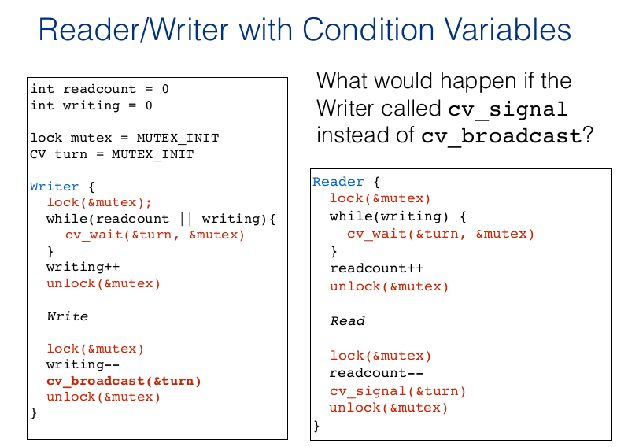

# Conditional Variables

* Internal data is just a queue of waiting threads

* Uses following <font color="red">atomic operations</font>
  
  > [Atomic Operation info](https://www.webopedia.com/TERM/A/atomic_operation.html) : An operation during which a [processor](https://www.webopedia.com/TERM/M/microprocessor.html) can simultaneously [read](https://www.webopedia.com/TERM/R/read.html) a location and [write](https://www.webopedia.com/TERM/W/write.html) it in the same [bus](https://www.webopedia.com/TERM/B/bus.html) operation. This prevents any other processor or [I/O](https://www.webopedia.com/TERM/I/I_O.html) [device](https://www.webopedia.com/TERM/D/device.html) from writing or reading memory until the operation is complete.
  > 
  > This is why, when a thread performs an atomic operation, the other threads see it as happening instantaneously, and will <u>never</u> interrupt. Atomic operations is that they are relatively quick compared to locks, and do not suffer from deadlock, and convoying. 
  
  * `cv_wait(struct cv *cv, struct lock *lock)`:
    
    * Releases the lock,
    
    * Waits(by sleeping)
    
    * Re-aquires lock before return
  
  * `cv_signal(struct cv *cv, struct lock *lock)`:
    
    * Wake one enqueued thread
    
    * OS picks one <u>lucky</u> thread to wake up
  
  * `cv_broadcast(struct cv *cv, struct lock *lock)`:
    
    * Wake all enqueued threads, but only one of them re-acquires(since it previously acquired the lock and then released it to wait on a condition) the mutex(the lock). 
    
    * <font color="red">Always  check condition inside **while** loop before calling cv_wait</font><font color="blue">The other woken-up threads are no longer blocked on `pthread_cond_wait`. <u>They're no longer in the CV queue</u>, because their condition has been satisfied. . So now they're in the section of the `cv_wait` function where it tries to acquire the lock again, so it waits until the lock becomes available. The problem is that when they acquire the mutex, the condition might no longer be true, in which case they shouldn't actually hold the lock. This is why cv_wait is wrapped inside of a while loop(see code below). Because thread acquires lock, then executes while loop condition again, sees condition is not true and does `cv_wait` again, at which point it releases the lock .If condition is true however, then lock moves on to the critical section. This is why we need a while loop instead of an if loop, because we need to check if condition is still true once we wake up from `cv_wait`.</font>
  
  > If no one is waiting, **signal or broadcast has no effect**

* <mark>Conditional variables are always <u>used together</u> with locks</mark>. <font color="blue">Conditional Variables are used to make locks more selective, and only acquire on a specific condition.</font> The lock protects the shared data that is modified

* <font color="red">You can't directly modify the lock condition. You can only modify it with signaling or broadcasting, therefore in your while loop check against another variable to see if the condition is true or not. You can update that variable inside of CS, as is the case in the [example below](real-example). </font>

```c
lock_acquire(lock);


while(condition not true){
    // this will release the lock for others until condition becomes true, at which point it reaquires the lock and starts executing critical section
    cv_wait(cond, lock);
}
// ... critical section ...
printf("critical section");
// ..end section
cv_signal(cond); // or cv_broadcast(cond)


lock_release(lock);
```

## Real example

```c
#include <stdio.h>
#include <stdlib.h>
#include <pthread.h>
#include <semaphore.h>
// we only need 1 lock
pthread_mutex_t region_mutex = PTHREAD_MUTEX_INITIALIZER;
pthread_cond_t space_available = PTHREAD_COND_INITIALIZER;
pthread_cond_t has_some_data = PTHREAD_COND_INITIALIZER;

#define MAX 25

int buffer[MAX];
int nextfill = 0; 
int nextuse  = 0;
int size     = 0;
int loops    = 0;


void add_buffer(int value) {
    buffer[nextfill] = value;
    nextfill = (nextfill + 1) % MAX;
    size++;
}

int use_buffer() {
    int tmp = buffer[nextuse]; 
    nextuse = (nextuse + 1) % MAX;
    size--;
    return tmp;
}

void* producer(void *arg) {
    int i, id = *(int*)(arg);
    for (i = 0; i < loops; i++) {
        pthread_mutex_lock(&region_mutex);
        // WARNING: always need to do a while instead of an If for conditional variables, because we need to check if they still satisfy the condition
        while(size == MAX) {
            // it will release the lock and wait until space_available becomes true(1). at that point
            // it reaquires the lock
            pthread_cond_wait(&space_available, &region_mutex);
        }
        printf("Producer[%d] producing: %d\n", id, i);
        add_buffer(i);
        pthread_cond_signal(&has_some_data);
        pthread_mutex_unlock(&region_mutex);
    }
    return NULL;
}

void* consumer(void *arg) {
    int i, id = *(int*)arg;
    for (i = 0; i < loops; i++) {
        pthread_mutex_lock(&region_mutex);
        while(size == 0) {
            pthread_cond_wait(&has_some_data, &region_mutex);
        }
        int tmp = use_buffer();
        printf("\tConsumer[%d] consumed: %d\n", id, tmp);
        pthread_cond_signal(&space_available);
        pthread_mutex_unlock(&region_mutex);
    }
    return NULL;
}

#define PRODUCERS 1
#define CONSUMERS 1

int main(int argc, char* argv[]) {

    int i, pid[PRODUCERS], cid[CONSUMERS];
    if (argc != 2) {
        fprintf(stderr, "usage: %s <value>\n", argv[0]);
        exit(1);
    }
    loops = atoi(argv[1]);

    // array of threads both for consumers and for producers
    pthread_t P[PRODUCERS], C[CONSUMERS];
    for(i = 0; i < PRODUCERS; i++) { 
        pid[i] = i;
        // create PRODUCERS amount of threads,
        // which will execute function producer
        pthread_create(&P[i], NULL, producer, &pid[i]);
    }
    for(i = 0; i < CONSUMERS; i++) {
        cid[i] = i;
        // produce
        pthread_create(&C[i], NULL, consumer, &cid[i]);
    }
    // now make main thread wait for all producer threads
    for(i = 0; i < PRODUCERS; i++) { 
        pthread_join(P[i], NULL);
    }
    // make main thread wait for all consumer threads
    for(i = 0; i < CONSUMERS; i++) { 
        pthread_join(C[i], NULL);
    }
    return 0;
}
```

## Classical Problems in Multithreading

### Producer/Consumer Problem

- See locks chapter

### Reader/Writer Problem




* Notice that read is outside of the CS because we want to have multiple readers able to read at the same time

* In the writer section, threads block until readcount becomes 0. Essentially they wait until all threads are finished reading.


## Summary of Locks + Conditional Variable

* Locks provide mutual exclusion for critical sections

* CV block a thread that has to wait for something to happen first


