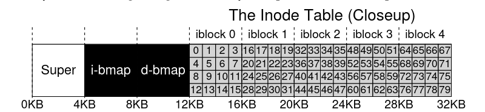

# File System Considerations

1. Consider data structures to use to keep track of data and metadata.
2. How to perform access methods: (open, read, write).
Consider how to do operations efficiently(open,close,delete,etc.)

## Data Structures

1. **Blocks**: Space on filesystem divided into blocks of data, typically 4KB.
2. **Data region**: Region which holds the user data.
3. **Inodes**: We need to keep track of metadata for each file(size of file,
owner and access rights, access and modify times, which blocks contain
the information).
4. **Inode table**. We store the inodes in an inode table, which we store in blocks, also at the beginning of the file. We can store multiple inodes
in the same block since an inode is pretty small(128-256 bytes), and
considering each block typically takes 4Kb(4096 bytes), we can hold about 80 inodes.
5. **Data and inode bitmaps**: We also need some data structures to keep track of which inodes or data blocks are free or allocated. Each bit indicates whether block/object is free(0) or in-use(1).
6. **Superblock**: Contains information about the particular filesystem. When mounting a file system, OS will read the superblock first to initialize
various parameters, and then attach a volume to the file-system tree. Things it tracks are: how many inodes and data
blocks are in the file system, where the inode table begins, etc.

### The Inode

* Structure that holds metadata for a given file(length, permissions), **AND** the location of the blocks which hold the file.
* Given an i-number(*each inode is implicitly referred to a number*), you should be able to calculate where on the disk the respective inode is.

* Here's how you address a *sector* of the inode block:

    ```
    blk = (inumber * sizeof(inode_t)) / blockSize;
    ```

    ```
    sector = ((blk*blockSize) + inodeStartAddr) / sectorSize;
    ```

    * You have to divide  by blocksize and sectorsize because the disks are
    not byte addressable, rather they consist of a large number of addressable sectors, usually 512 bytes, so you have to divide by the block.

* The inode itself contains virtually all information you need about the file:
    * Type(regular type, directory, etc)
    * Size
    * Number of blocks allocated to it
    * Protection information(who owns the file, who can read, write, execute.)
    * Some time information

* One of the most important decisions is how inode referse to where data blocks are. One simple approach is to have 1 or more direct pointers(**disk addresses**) inside the inode, each pointer refering to one disk block that belongs to a file. 

#### Multi-level inode

* Have both *direct pointers* and *indirect pointers*.
* **Indirect pointers** refer to blocks that contains more pointers, this massively increases the size your file can have. Consider that a block has 4Kb and a pointer is 4bytes, you can fit 1000 pointers inside one of those blocks.
* <mark>You keep using direct pointers until you run out of space. Once you are done with them, stat using indirect pointers and filling up those blocks.</mark>
* You can add *double indirect pointers*, which points to a block that contains *indirect pointers*, therefore that block can contain 1024 indirect pointers, and since each indirect pointer can contain 1024 direct pointers to blocks, that means you will have 1024 * 1024 = 1,000,000 blocks, i.e 1,000,000 * 4 bytes = 4,000,000 bytes = 4GB.
* If you add *triple indirect pointers*, you have a block of 1024 double indirect pointers, and since each double indirect pointer can have 1,000,000 blocks, that means your *triple indirect pointer* contains 1,000,000,000 blocks, i.e 1,000,000,000 * 4 bytes = 4,000,000,000 bytes  = 4TB. 

####  Extent-based approach

* <mark>Use **extents** instead of pointers. An extent is a disk pointer + a length(in blocks), so instead of requiring a pointer for every block of a file, you use a pointer + a length to specify on-disk location of a file.</mark>
* Have multiple extents for the same file.

#### Link-based approach

* Use a **linked list**.Instead of having multiple pointer, have just one,
which points to the first block of the file. *Then add another pointer at
the end of the data block, and so on*.
* **Advantages**: supports arbitrarily large files only limited by size of the FS.
* **Problems**: performs poorly for some workloads, for example if you need to read the last block of a file, or just doing random access.
* <mark>Some systems will have an in-memory table of link information, instead of
storing the next pointers in the data blocks.</mark>.
    * Table is indexed by address of data block D(so you're at data block D, and then you look inside the table, where the content is the pointer to the next data block.)
    * Makes it easy to do random file access(simply scan through in-memory table to find desired block, and access it on disk directly.)
    * *This is the basis of FAT system(file allocation table)*.

#### Optimizations 

##### Findings from research
|Finding|Explanation|
|-------|--------|
|Most files are small| 2Kb is most common size|
|Average file size is growing| Almost 200kb is now average|
|Most bytes are stored in large files| Few big files use most space|
|File system contains tons of files| 100K on average|
|File systems are roughly half full| 50% full on average|
|Directories typically small| Most < 20 entries|

## Directory Organization

* Directory contains: **<file_name, inode number\>** pairs
* You want to have the following structure

|inum|reserved_inode_number|reclen|strlen|name|
|----|---------------------|------|------|----|
|5   | 2 |12| 2| .|
|2   | 2 |12| 3|..|
|12   | 12 |4| 1| foo|

* *inum* is the inode number(which you can access as shown previously)
* *reserved_inode_number* keeps track of the number of references to a file. When they become 0(through unlink()), the file is deleted.
* *reclen(record length)* the total bytes for the name + leftover space
* *strlen* is the actual length of the name
* *name* is the actual name of the file.

### Storing directories

* Storing as a regular file
    * Stored as a special type of file, therefore also has an inode(somewhere in inode table), and the type field inside the inode is marked as "directory" instead of "regular file". 
    * This makes it simple to store directories. On-disk structure remains unchanged.
* Store directories in B-tree form(XFS[S+96])
    * Makes file creations faster(since you can check much faster if a file like that already exists)

## Free Space Management

* <mark>File system **must** track which inodes and data blocks are free and which aren't, so it can find space when a file or directory is created/modified</mark>.
* **Bitmaps**: If inode bitmap, One bit for every inode, and 1 if occupied, 0 if free. When we create a file, OS searches through bitmap for a free inode, allocates it to the file, then FS marks the inode as used(w. 1 in bitmap). Similarly for the creation of a data block.
    * <mark>**Optimization with Pre-allocation**: ext2 and ext3 looks for sequence of blocks(for eg. 8) that are free, so when you create a file and it needs data blocks, give it a contiguous portion on the disk, which will improve performance.</mark>
* **Free lists**: single pointer in super block points to first free block on FS. That block then keeps next free pointer, which creates a *list* of free blocks on the system. 

## Access Paths: Reading and Writing

* Assume file system is already mounted, and superblock is in memory(everything has been set up already).

### Open

`open("/foo/bar", O_RDONLY)`

*   FS first finds the inode for the file bar, to get basic info about the file(permission information, file size, etc). **THerefore, FS must find inode, given full pathname).
    *   FS must **traverse** the pathname and and locate the desired inode. I.e it starts at the root directory("/") which it already loaded, and then it traverses to the file through all the directories on its path.
------

1.  Begin traversal at root directory, which FS already knows from the *superblock*. Additionally, most often root inode number is 2, so FS would begin by reading the block that contains inode number 2.
2.  Once FS has the directory inode, look through the data blocks, for an entry for the actual file or for the next directory in the path. Once you get it, you can also get its inode, at which point move to the next inode recursively. 
3.  Final step is to read bar's inode into memory, where FS does permission check, allocates a file descriptor for this process in the per-process open-file table, and returns file descriptor to the user.

### Read

* When `read()` is called, first read(offset 0, unless lseek() is called), will read from first block of the file.
* read() will further update in-memory open table for file descriptor, updating file offset such that next read is read from 2nd file block, etc.
* Potentially update inode with new last-accessed time

### Close

* Deallocate the file descriptor.

### Write

1. First user must call `open()`, as described before.
2. Then user can call `write()`, and update file with new contents. <mark>When writing, each write must first decide which block to allocate to the file, and update structures on the disk accordingly(data bitmap **and** the inode).</mark>
3. Close the file.

> Each write generates 5 I/Os:
1. Read data bitmap to find out which block to use to add info.
2. One to write the bitmap(reflext that a previously free block is now busy, OR free)
3. Read inode to get block location.
4. Write to inode to update new block location.
5. Write actual block.


#### File Creation

* FS must allocate inode + allocate space within directory for new file.
* One read to inode bitmap(find free inode), one write to inode bitmap(initialize it), one write to directory data block (link high-level name of file to inode number), one read and write to directory node to update it.
* *If directory needs to grow to accomodate new entry*, will need additional I/Os.


## Notes for Project

* Can use Pre-allocation
* Use bitmaps
* Target system more towards smaller files(which are the most common ones.)