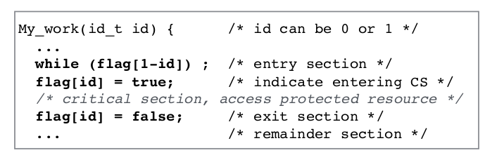
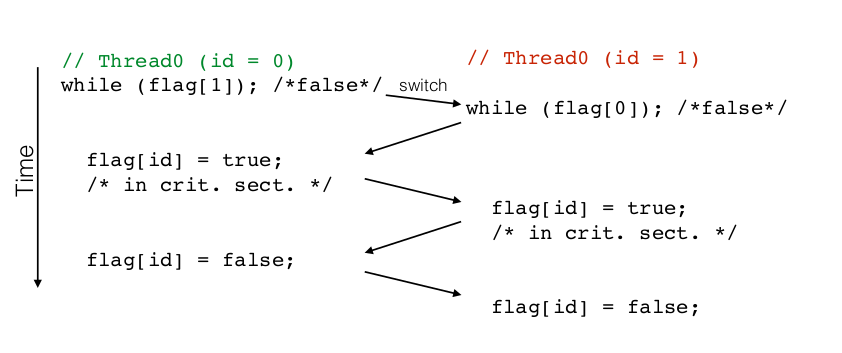

# Synchronization

<font color="blue">By design, threads/processes can't anticipate when they are forced to yield the CPU through a context switch.</font> Therefore, we need a way to make sure that threads share memory in a safe manner. We do that with synchronization.

## Types of synchronization

1. Enforce <u>single use</u> of a shared resource, i.e only 1 thread can access a resource at the same time. This is called the <font color="red">critical section problem</font>. By ensuring only 1 thread can access the resource, that means any future thread will only access it once it is updated, so there is no case where 2 threads are modifying data at the same time. This guarantees correctness.

2. Control order of thread execution.

## Critical Section(CS) requirements

<font color="blue">Only 1 thread can access a shared resource at the same time</font>. CS has shared variables which need to be <u>synchronized</u> to maintain consistency of data varaibles.

1. **Mutual exclusion**
   
   If one thread is in the CS, no other thread is.

2. **Progress**
   
   If no thread is executing in the critical section and other threads are waiting outside CS, **only threads trying to get into CS section can influence the choice of which thread enters next**, and **choice cannot be postponed indefinitely**. Essentially <mark>a process not requesting Critical section should not block other processes from entering the critical section.</mark>

3. **No starvation**(bounded waiting)
   
   Once a thread T makes a request to access CS, *There is a bound(a limit)* on number of times that other threads are allowed to enter CS before thread T is granted access, i.e **eventually a thread which wants to access CS <u>must</u> be allowed to access it.**

### First Synchronization attempt:

```c
void my_work(id_t id){
    /* XXXXXXX   entry section   XXXXXXX */
    // repeat indefinitely until it's your turn,
    // i.e turn becomes your id*/
    while(turn != id); 
        /* XXXXXXX   Critical section   XXXXXXX */
        // now we're in critical section, only the thread with the right ID(and ids are unique) can access it
        printf("now you're in critical section");

        /* XXXXXXX   Exiting critical section   XXXXXXX */
        turn = 1 - id; //change the id
        // ...
}
```

* The above satisfies **mutual exclusion**: only 1 thread can access CS
* Above does not satisfy **progress**: if turn = 0, T1 may not enter even though it has gotten there before T0(or even if T0 is in another section), therefore it's not influencing the choice of which thread enters next, as something else has. <mark>If we don't have progress, then we have starvation</mark>

### Second Synchronization attempt



<font color="red"><mark>Threads can yield execution at ANY TIME **after they finish current instruction. A thread cannot switch half-way through executing an instruction.**</mark> Here, one of them executes condition from while loop, and then GIVES UP CONTROL, at which point when control comes back to it, it's too late to lock the CS.</font> Therefore in this case it **does not satisfy mutual exclusion**, since multiple threads can be in CS at the same time



### Synchronization: Peterson's Algorithm

```c
//NOTE: loser and flags are both global variables, so both threads have access to them and can modify the global version(and the changes propagate)
int loser;
int flags[2]; /* Show "interest" in CS, are both initially 0, aka false*/

void my_work(id_t id) { // id will be 0 or 1 depending on which id it is
    //...
    flag[id] = true; // entry section
    // by setting loser to itself, thread is being polite and allows other threads to enter. Assume this thread is the last one to arrive, so it sets loser to itself and the other thread can now move into critical section.
    loser = id;
    // Entrance is granted for T0 if T1 does not want to enter(flag[1-id] is False) OR if T1 gave priority to T0 by setting loser = 1.
    while(loser == id && flag[1-id]);
    /* Critical section */     
    printf("in critical section now");
    /*Exit section */
    flag[id] = false;          
    }    
}
```

* Assume 1 thread arrives but not the other. In that case flag for other will be set to False so this thread can go ahead(therefore progress is satisfied-only the threads waiting for CS can get in).
  
  * If multiple threads want to access something at the same time

* <font color="blue">Final value of turn/loser determines which of the 2 processes is allowed to enter its critical section first</font>, and because turn doesn't change it guarantees mutual exclusion where other thread cannot enter, UNTIL it sets its flag to false.

* Alg. can be extended to N threads

### Synchronization: Lamport's Bakery algorithm

* Upon entering each customer/thread gets a #

* The thread with lowest number is served next

* There's no guarantee that 2 threads don't get the same number. In the case of a tie, thread with lowest id is served first. Thread ids are unique and totally ordered.

### Synchronization Hardware vs Software

Peterson's and Lamport's bakery algorithm show that <u>synchronization can be implemented in software</u>. However, **hardware instructions make it easier and more efficient** to build up higher-level abstractions for synchronization.

#### Disabling interrupts

```c
void lock(){
    disable_interrupts()
}
void unlock(){
    enable_interrupts()
}
```

This is one solution on hardware level to create locks to enable synchronization and **ensure mutual exclusion**.

From [Operating Systems](http://www.cs.nott.ac.uk/~pszgxk/courses/g53ops/Processes/proc06-mutexbusy.html):  Perhaps the most obvious way of achieving mutual exclusion is to allow a process  to disable interrupts before it enters its critical section and then enable interrupts after it leaves its critical section.  

By disabling interrupts the CPU will be unable to switch processes. This guarantees 
that the process can use the shared variable without another process accessing 
it. But, disabling interrupts, is a major undertaking.

**Disadvantages**:

* The computer will not be able to service interrupts for, maybe, a long time, depending on what a process is doing in a critical section.

* The process may forget to neable interrupts,  which will effectively crash the computer.

* On multiprocessor systems other processors can still access it, this only stops context switches between threads not between processes.

## High Level Synchronization types

1. **Locks**: good for <u>protecting access to critical sections</u>

2. **Condition variables**(Condition can be any boolean expression): They <u>wait for a condition to become true</u>

3. **Semaphores**:
   
   1. Basic, <u>easy to understand</u>
   
   2. Good for some race conditions where <u>you can set the order</u> in which threads will execute. **race condition**: condition where multiple threads access Critical Section and both try to <u>update</u> a shared veriable. *Note* that reading is not considered updating since it doesn't change the value.
   
   3. Not always the right abstraction

4. Monitors: high-level, ideally have language support( Java)
