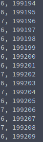

# Locks

```c
// Thread creation and destruction


// creates a thread
int pthread_create(pthread_t *thread, const pthread_attr_t *attr,
                          void *(*start_routine) (void *), void *arg);
// example
pthread_t t1;
err = pthread_create(&t1, NULL, thread1, (void *)0);


// block until child thread finishes
int pthread_join(pthread_t thread, void **retval);
// example
pthread_join(t1,NULL);

//pthread exits
pthread_exit()


// Locks with threads
pthread_mutex_t mutex = PTHREAD_MUTEX_INITIALIZER;
pthread_mutex_lock(&mutex);
count++;
printf("%d, %d\n", gettid() % 10, count);
pthread_mutex_unlock(&mutex);
```

## Atomic instructions(test and set)

```c
boolean TAS(boolean *lock){
    if(*lock == False){
        // if no lock, return that there's no lock and lock it. Essentially if there's no lock, we can pass inside the critical section and TAS also locks it.
        *lock = True;
        return False
    }
    else{
        return True;
    }
}
```

> * Lock is always true on exit from test-and-set. either it was already True(locked) and nothing changed, or it was False(available), and now the caller holds it.
> 
> * Return value is True if it was locked already, or False if it was previously available

## Lock implementations

### Spin Lock

```c
boolean lock;

void acquire(boolean *lock){
    while(test_and_set(lock)); // as long as its true, it means it's already locked by somebody else so keep executing while loop. Once it turns to False, it means that it became available, and TAS already locked it for this caller. so this thread now holds it and you can return.
}

void release(boolean *lock){
    *lock = false; // to release simply set to false
}
```

Previous example is a **spin lock**: it uses <u>busy waiting</u> - thread continually executes while loop is in acquire, which consumes CPU cycles.

Spin locks have 3 problems:

1. Busy waiting $\rightarrow$ consumes CPU cycles

2. **Starvation is possible**: 
   
   When a thread leaves its CS, the next one to enter depends completely on scheduling. It depends entirely on which thread the OS chooses to execute next. Therefore, whilst *extremely unlikely(very very low chance)* it is possible that the OS always chooses some other thread to execute before this one, so this <u>waiting thread could be denied entry indefinitely</u>

3. Deadlock is possible through <font color="red">priority inversion</font>.

### Sleep Lock

> wait queues in Linux

* Instead of spinning, **put thread to sleep**(into "blocked state"), while waiting to acquire lock

* Requires a queue of waiting threads, from which the OS will choose next thread to wake up. Advantage is that starvation is not possible because the queue can function in a FIFO fashion, such that given all things equal, a thread that asks for a lock first will acquire it first if other threads also want it.

```c
wait_event(queue, condition);
wake_up(wait_queue_head_t *queue);
```

## Lock example

```c
#include <stdio.h>
#include <unistd.h>
#include <pthread.h>
#include <semaphore.h>
#include <stdlib.h>
#include <sys/types.h>

// initialize the lock
pthread_mutex_t mutex = PTHREAD_MUTEX_INITIALIZER;
int count = 0;

// We give threads specific functions to execute. This is the function we want threads
// to perform. Thread finishes when it calls pthread_exit(3), if it returns from start routine,
// or if it is cancelled (pthread_cancel).
// Before  returning,  a  successful call to pthread_create() stores the ID of the new thread in
// the buffer pointed to by thread; this identifier is used to refer to the
// thread in subsequent call to other pthreads functions.
void *thread1(void *threadid){
    printf("Start thread %ld\n", gettid());
    int i;
    for(i = 0; i < 100000; i++){

        pthread_mutex_lock(&mutex);
        count++;
        printf("%d, %d\n", gettid() % 10, count);
        pthread_mutex_unlock(&mutex);
        // simulate doing more work. allows another thread to grab control and print
        usleep(2);
    }
    printf("End thread %d\n", gettid() % 10);
    pthread_exit(NULL);
}

int main(int argc, char *argv[]){

    pthread_t t1, t2;
    int err;

    // create a new thread, and indicate what function it should run. Once you create it,
    // control might shift directly to the thread, or could still belong to the processor
    err = pthread_create(&t1, NULL, thread1, (void *)0);
    if(err){
        printf("Error: pthread_create failed %d.\n", 0);
        exit(1);
    }
    err = pthread_create(&t2, NULL, thread1, (void *)0);
    if(err){
        printf("Error: pthread_create failed %d.\n", 1);
        exit(1);
    }

    pthread_join(t1,NULL);
    pthread_join(t2, NULL);

    printf("Controller\n");

    // exiting thread
    pthread_exit(NULL);

}
```

**example of the output**:


