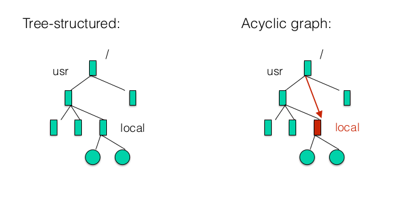
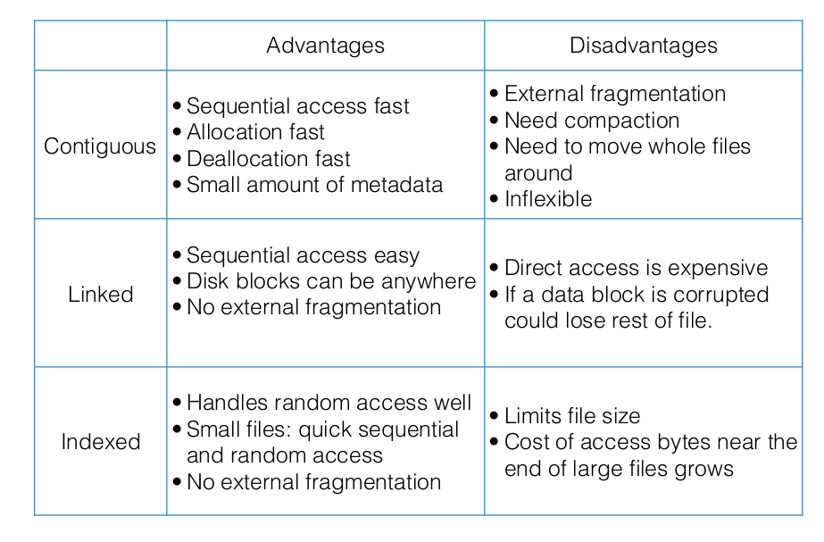
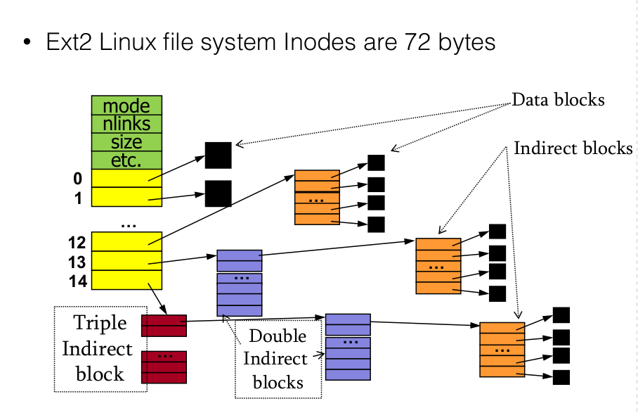
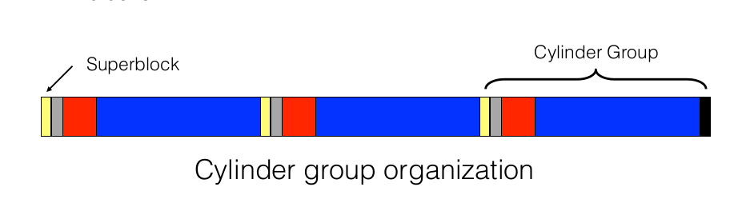

# Files and File Systems

## Top requirements for an OS

**Virtualization**:

* present physical resources as a more general, easy-to-use form of itself

* present illusion of multiple resources where only a couple exist. For example, you can have only 1 core, but you can create 'as many processes as you want' to run them at the same time.

* <font color="blue">Files and directories abstract away the hard drive</font>

**Concurrency**

* Coordinate multiple parallel activities to ensure corectness

**Persistence**

* Need to persist data. Data needs to survive crash.

* <font color="blue">File systems control how and when data is transferred to persistent storage</font>.

## File Systems

Requirements:

* Store large amounts of information

* Information must survive crashes and termination of processes

* Multiple processes must be able to access information concurrently

### File Operations

* Creating a file

* Deleting a file

* Writing to file

* Reading to file

* Moving a file

* Truncation and appending

### Directories

* **For user**: convenient way to <u>organize files</u>

* **For OS**: convenient <u>naming interface</u>

#### Directory Structure

* A directory isa  list of entries <name, associated metadata>. Associated data can be(size, protection, user access, location, etc)

* Unordered list of entries

* <u>Directories are implemented as a file</u>, which means you need to manage only one kind of secondary storage

#### Directory Implementation

* Acyclic-graph directories: imeplmenetned in Unix: same file or directory can be in 2 different directories. DIfferent from tree-structured which may not have cycles.



* Implementation:
  
  * **List**: requires linear search to find entries, easy to implement but slow to execute
  
  * **Hash table**: take space, faster.

### File Links

* Hard links:
  * directory entry refers to "true path" to the file
  * Each file has a count of how many references it has. if you delete the entry, you check if the hard links is equal to 1(i.e this directory is only one pointing to it), and if yes, you actually delete the file at that path. Otherwise you just delete the current reference to it from your directory but leave the file intact since there are other references to it. In normal cases, like editing a file, you're editing the file at the true path so all references to it will point to the updated file
* Soft links
  * with a soft link, you **refer to a file** which holds the true path of the linked file. The advantage of this is that you can work across file systems. Disadvantage is that if you delete the file, link remains in place. Another disadvantage is that you don't actually delete the file, you delete the soft link to it.

## File System Implementation

* File systems use <u>blocks(4Kb) to store data</u>. If our disk is 64 kb, we have 16 blocks.

* <u>Superblock/master block</u> <mark>determines location of root directory</mark>
  
  * superblock always at well-known disk location(might be in dirst block)
  
  * sometimes replicated for reliability
  
  * Includes other important information about file system(how many inodes, data blocks there are, where bitmaps and inode begin)
  
  ```c
  typedef struct a1fs_superblock {
  
      // basic file system info: type of file system, size of file system, number of inodes
      /** Must match A1FS_MAGIC. */
      uint64_t magic;
      uint64_t size;
      unsigned short s_inode_size; 
  
      // number of inodes, blocks + free inodes and free blocks
      unsigned int s_inodes_count;     
      unsigned int s_blocks_count;      
      unsigned int s_free_blocks_count; 
      unsigned int s_free_inodes_count;
      // Location of bitmaps and tables
      a1fs_extent data_blocks_extent;      
      a1fs_extent block_bitmap_extent;      
      a1fs_extent inode_bitmap_extent;     
      a1fs_extent inode_table_extent;     
  
  } a1fs_superblock;
  ```

* We have <u>bitmaps</u> which determine which blocks are free, one bit per block on disk. They can be *cached in memory for performance*

* <font color="blue">In ext2, we have a bitmap for inodes, and a bitmap for data blocks</font>

* <u>Inode table</u> stored in 1+ blocks. Inode table

* Remaining blocks used to store files and directories

### Disk layout strategies

Files often span multiple blocks, since they are greater than 4Kb(or whatever size of the block is). Here's how to find all blocks of a file:

1. <u>Contiguous</u> allocation:
   
   **Advantages**: fast, simplifies directory access. 
   
   **Disadvantages**: inflexible, causes external fragmentation

2. <u>Links</u>
   
   **Advantages**: each block points to the next, directory points to the firss. Good for sequentia/continuousl access
   
   **Disadvantages**: terrible for random access

3. <u>Indexed structure/inode</u>: index block contains pointers to many other blocks.
   
   **Advantages**: handles random access well, b/c has pointers to all blocks. Pretty good for sequential



#### Inode structure: Unix Inodes

* All file metadata is stored inside an inode

* Unix directories map file names to inode: <file_name, inode_number>

* Each inode contains 15 block pointer:
  
  * 12 are direct block pointers(disk addresses of first 12 data block pointers)
  
  * 13th is single indirect block pointer: points to block containing direct block pointers
  
  * 14th is a double indirect block pointer: points to block contiaining addresses of single indirect blocks
  
  * 15th is a triple indirect block pointer.
  
  * Total size will be: $4Kb*(12+ 1024+1024^2 + 1024^3) \approx 4Tb$
  
  * Advantages of imbalanced tree like this are:
    
    * most files are small($\approx 2Kb$)
    
    * Files are usually accessed sequentially
    
    * DIrectories are typically small(20-)
      
      Therefore, most of them will fit inside of the direct blocks, which results in a very fast sequential + random access. Once file becomes larger, than need to use indirect blocks.



#### Extent-based approach

```c
/** Extent - a contiguous range of blocks. */
typedef struct extent {
    /** Starting block of the extent. */
    int start;
    /** Number of blocks in the extent. */
    int count;
}
```

* **Advantages**: uses smaller amoutn of metadata per file, <u>file allocation is more compact</u>

* **Disadvantages**: <u>less flexible than pointer-based</u> approach, but still a  lot more flexible compared to contiguous allocation. This sort of does contiguous allocation but on a much smaller scale, where it's blocks of contiguously allocated files.

* **Used by**: ext4, HFS+, NTFS, XFS

#### Link-based approach

* FAT file system ,sued by WIndoes before NTFS

* Instead of pointer to all blocks you have a table where the inode just has one pointer to first data block o the file, then first block points to second block etc

**Disadvantages**: very bad random access, or accessing last blocks of file since you need to move through all data blocks first.

##### NTFS

* Each **volume(partition)** is a linear sequence of blocks.

**Master File Table**:

* **Each volume has a **Master File Table**(MFT)

* MFT is full of 1 kb **Records**(MFR). 

**Records**(they're similar to inodes but more flexible):

* <u>1 or more records per file/directory</u> .

* MFT records are <u>variable length</u>

* Long attributes can be stored externally, and a pointer kept in MFT record. Otherwise MFT record prefers to keep data inside of it(so it will store dentries inside of an MFT record as well as the actual data inside a small file). 

* If data won't fit inside an MFT record, NTFS will to allocate files in **extents/runs of consecutive blocks** and give pointers towards them.. 

* Records contain a lot of metadata(key value pairs), which allow for implementation of extra features: compresion, different file types.

#### Fast File system

> meant for hard disk-based environments

##### Cylinder Groups

* Disk partitioned into groups of cylinders(bitmap + inodes + data blocks all in the same group)

* Data <u>blocks in same file allocated in same cylinder group</u> which decreases seeking when reading a file

* Files in<u> same directory allocated in same cylinder group</u> which decreases seeking when finding a file in a path, because folders are also considered files so we want to stay within the same cylinder group preferably.

* <mark>Inodes for files allocated in same cylinder group as file data blocks</mark> which decreases seeking



##### More FFS improvements

* Use larger blocks(4K) with fragments(1K pieces) instead of small blocks(1K)

* <mark>Small block size leads to a small max file size + low bandwidth utilization.</mark>

## Mounting a file system

1. OS reads the superblock

2. OS identifies type of FS + other parameters

3. OS attaches the volume to the file system tree

## Reading a file

1. Find the inode number from the dentry(directory entry)

2. Find the inode inside of the inode table. e.g: if inode is inode #32 then find it at:$4kb(blocksize) \times 3 + 128b (size\; of\; inode) * 32$

3. Once you have the inode, inode has pointer to all of its data blocks, so do the same strategy to get to the data blocks and then read them.

**Say you want to open file** `/one/two/three`:

1. Master block for the location of inode for “/”

2. Directory block for “/” - search for “one”

3. Inode block containing inode for “one”

4. Directory block for “one” - search for “two”

5. Inode block containing inode for “two”

6. Directory block for “two” - search for “three”

7. Inode block for “three", open()

## VFS(Virtual File System)

* Works as an <u>Abstraction file system interface</u>. User-level programmer interacts with file systems through general system calls, without worrying about which system call it is.

* Helps OS support file system and programmers not code towards a specific file system
