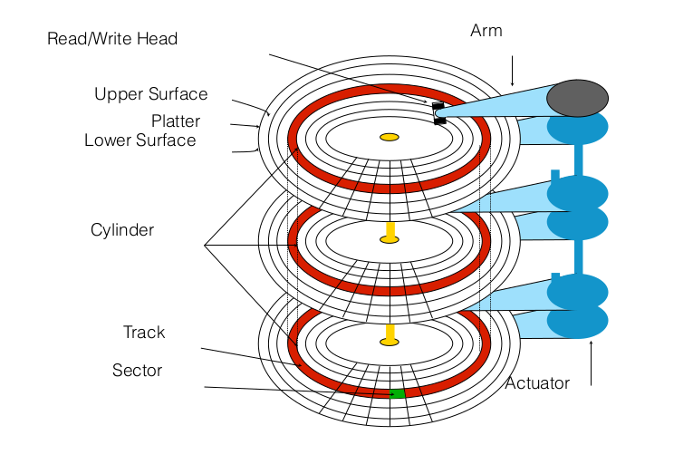
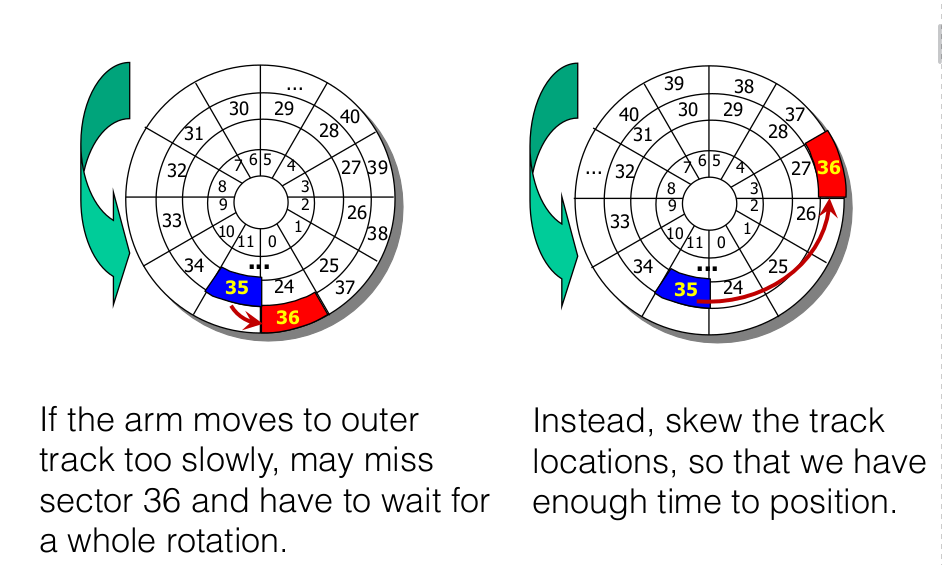

# Disks I/O

## Secondary Storage Devices

* Drums: ancient

* Magnetic Disks: fixed, removable

* Optical disks: write-once, read-many for CD-R and DVD-R or write-many, read-many for CD-RW

* Flash memory: <u>solid state</u>, non-volatile memory

## Disk Performance

**Seek** - moving disk arm to correct cylinder, and correct track

1. Depends on how fast the arm can move(improving slowly 7-10%)

2. **Rotation** - waiting for sector to rotate under the head, on the same track
   
   Depends on rotation rate(hasn't changed recently), Average latency of 1/2 rotation

3. **Transfer** - transferring data from surface into disk controller electronics
   
   depends on density(improving quickly 40% per year), 100Mb/s

### Optimizations

* **Track skew**: skew the track locations so that we have enough time to position

* **Cache**: a small memory chip, part of the hard drive(8-16 MB). it's different from OS cache. **It is aware of disk geometry**, and when reading a sector may cache the whole track to speed up future reads on the same track

* **Zone**: each sector is 512 bytes. schedule disk requests to queue them in the most optimal way</mark>

* Modern disks do disk scheduling themselves, because they know their layout better than OS so can optimize better, therefore they undo any scheduling done by OS.

### Methods

* FCFS( do nothing)
  
  * Reasonable when load is low
  
  * Long waiting times for long queues

* SSTF(shortest seek time first(shortest movement to the right track))
  
  * <u>Minimize arm movement, maximize request rate</u>
  
  * Favors middle blocks

* SCAN(elevator): service requests in one direction until done, then reverse

* C-SCAN: like SCAN but only go in one direction.

* Look/C-look: like C-Scan but <mark>only go as far as last request in each direction</mark>

File systems need to be aware of disk characteristics for performance

- **Allocation strategies** to enhance performance. Best ones is allocating related data close together. This is a "**closeness**" property of disks:<mark>reduce seek times by putting related things close to one another.</mark>. Can improve performance X2 times. Another one is * **Amortization**:  <mark>amortize each positioning delay by grabbing lots of useful data.</mark>-essentially caching the whole track. Can improve X10
- **Request scheduling** to reduce seek time. Use something like Look or C-Look.

> Note: Fragmentation on aging file system causes more seeking. <u>Fragmentation refers to condition where files are divided in pieces scattered around the disk</u>. Therefore defragmentation software is meant to move files into blocks next to each other.
