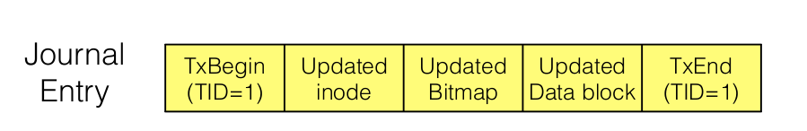
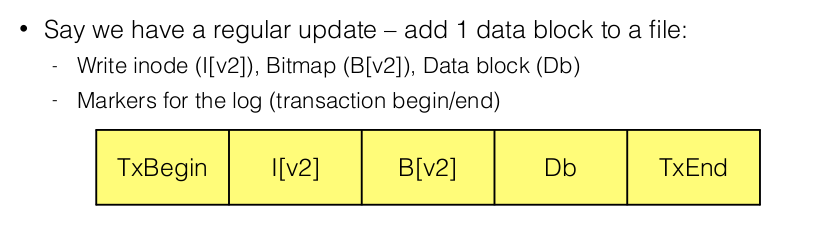

# File System Reliability

* Goal: ensure FS is in <u>consistent</u> state in event of OS failure.

* **Consistent state**: looks like operation either never occured, or like it completed.

## Approaches

1. Do nothing, and choose good order for operations to minimize data loss. Most old file systems took this approach(ext2, ffs)

2. Treat each FS operation as transaction. Roll-back if transaction didn't complete.

## Crash recovery

When FS comes back up, run program to scan FS and restore consistency.

### `fsck`

**Checks**:

* <mark>All referenceddata blocks(by inodes) must be allocated in data bitmap</mark> (i.e all used data blocks are allocated in bitmap)

* <mark>All allocated inodes must be in some directory entry</mark>(i.e all inodes are being used)

* <mark>Inode link count must match directory entries.</mark>

**Disadvantages**:

* Only checks FS integrity, can't <u>restore any lost data</u>

* <u>Too slow</u>: scanning could take hours, because disks are very large.
  
  **Disadvantage**: it can't detect if data block didn't get written.

### Journaling

> * A.k.a write-ahead-logging
> 
> * Ext3 extends ext2 with journaling capabilities. Journal can be  implemented as a regular(albeit large) file on FS, making it backward and forward compatible with ext2
> 
> * Widely adopted in most modern file systems(ext3, ext4, XFS, NTFS, etc).

* Write a log on disk of the operation you're about to do, before making any changes

* If a crash happens *before journal write finishes*, doesn't matter since actual write hasn't happened yet, so FS remains consistent

* If a crash happens *during actual write* $\rightarrow$ go back to journal and retry actual writes. 

#### Log

Log consists of transactions. Each transaction starts with (TxBegin), follow with logging of exact physical content, and end with (TxEnd)

##### Sequence of operations:

1. *Journal Write step*: Write all operations except TxEnd. 
   
   If crash happens here, just skip. no inconsistency.

2. *Journal Commit step*: Write TxEnd(once 1.completes, then you have a guarantee that the write of operations was completed safely without any errors).

3. *Checkpoint step*(writing data to FS): Write the data and metadata to FS.
   
   If crash happens during checkpoint step, after reboot, scan the journal, look for committed transactions, <u>replay them</u>, and after replay FS is guaranteed to be consistent.

4. *Free step*: Mark the transaction as free in the journal./ i.e delete it.

##### Metadata Journaling

Major problem:(*See diagram above*) we write data after checkpoiniting metadata, so if crash occurs before all data is written, inodes will point to garbage data

**Solution**:: write data BEFORE writing metadata to journal

1. Write data, wait until it completes

2. Metadata journal write

3. Metadata journal commit

4. Checkpoint metadata(will only deal with inode ids, block locations, doesn't actually write any data, since all data was already written).

5. free

## RAID

