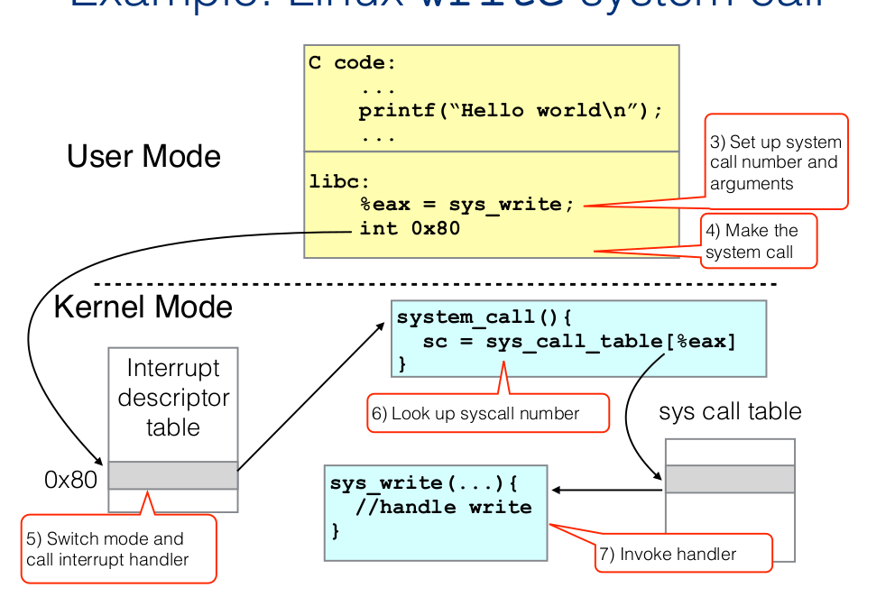

# System Call

* System call is a **function that invokes the OS**. App wants to use a resource that OS manages, so asks for permission, and if it has the permission, OS does some work for it.

## Interrupts(exceptions/traps)

* OS is an event-driven program. It responds to interrupts, most of which(maybe all, not sure) are defined by interrupts.

* <mark>Interrupts indicate that something needs attention of OS</mark>. They can:
  
  * <u>Signal a system call,</u>(*software interrupt*): a request for OS to 'take the wheel and do something for an App'
  
  * <u>Signal an error</u>(*software interrupt*): that occured
  
  * Timer interrupts, where OS switches to another process(*hardware interrupt*)

* Interrupts are predefined, so whenever one happens, CPU jumps to a routine for that specific interrupt.

## Boundary Crossings

**From user mode to system mode(User to Kernel)**

* *Hardware interrupt*:  (timer interrupt where OS decides to switch process or error(seg fault, divide by 0 etc))

* *Software interrupt*: system calls

**From system mode to user mode(Kernel to user)**:

Once OS finsihes its task, it goes back to applications(probably picks next process from ready queue. It sets up the next process(registers, mode for application, jumps to next application instruction)

## Privileged Instructions

CPU Hardware can only run in *user mode* or *system mode*. Some instructions are *privileged instructions*, they can only run in system mode. CPU checks current protection level for each instruction. On a "system call interrupt", the <u>mode bit</u> is switched as you mode to system/kernel mode to allow for privileged instructions.

Types of Privileged instructions:

* Access I/O device: poll for IO, perform DMA, catch hardware interrupt

* Manipulate memory management: set up page tables, load/flush the TLB and CPU caches

* Configure various "mode bits": interrupt priority level, software trap vectors, etc

* Call halt instruction: put cpu into low-power or idle state until next interrupt

## System Calls Interface

1. User program calls C library function w. arguments. C library function passes arguments to OS.

2. User process runs special instruction (x86 INT). This generates a  <u>system call software interrupt</u>(there are different types of software interrupts, system call is one type). 
   
   * **INT** is an assembly language instruction for **x86** processors that generates a software **interrupt** for a system call, with the **interrupt** number as an argument.

3. [Stept 5 from image]Kernel looks up the software interrupt code in the interrupt descriptor table.It sees that it's interrupted for a system call. 

4. [Step 6 from image]Kernel looks in the system call table, and invokes the function implementing that call.

5. System/Kernel verifies the arguments for routine.

6. System executes rutine and then **returns result in register EAX**, <mark>runs iret(interrupt return)</mark>
   
   * **iret** is an interrupt. It switches back to the user, and restores the user space.

### System Calls in Linux

You can invoke any system call from userspace using `syscall(syscall_no, arg1, arg2,...)`
