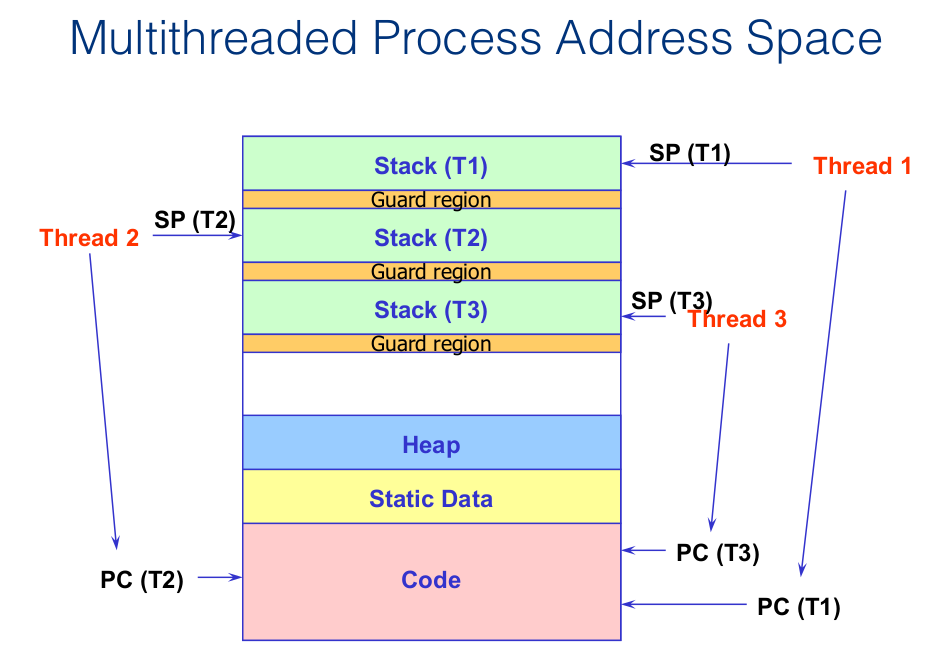
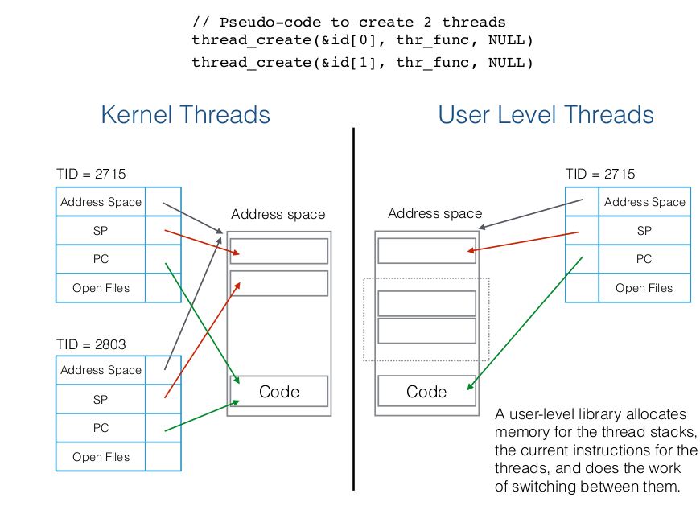

# Processes and Threads

## Interprocess Communication

Processes can communicate with each other through:

* signals

* pipes

* sockets

* files

Processes can share memory with each other:

1. use shmget()
* `shmget()`: sys call tells OS to allocate <u>shared memory region</u>(sort of like malloc tells OS to allocate mem region in heap)

* `shmat()`: maps shared memory to some address. If you choose NULL, OS chooses address for you
2. `mmap()`: another approach for creating shared memory region

### Disadvantages:

* *Space*: Need multiple PCB, page tables, etc

* *Time*: very time-consuming to fork and copy address space, create data structures, etc

* Inter-process communication: extra work is needed to share and communicate across isolated processes.

---

## Threads

**Definition**: a thread is a *single control flow* through a program. A program w. multiple control flows is multithreaded.

Recall that a process is:

1. Address space:
   
   * Code
   
   * Heap

2. Execution state
   
   * program counter
   
   * stack pointer

3. OS resources
   
   * open file table, etc.

Main idea: <mark>Separate the address space from the execution state.</mark>Then multiple "threads of execution" can share the same address space(same space + access to the heap) but have their independent execution state(their own program coutner and )

> Note: All the threads see the same data, otherwise they'd be considered 
> different tasks; if some data can only be accessed by a particular 
> thread, that's usually solely the purview of the programming language, 
> not of the operating system.

**This is what threads turn into**:

* Address space(shared)):
  
  * Code(machine code of the program, which means all threads can call the same functions)
  
  * Heap(can access the same data defined in the heap)
- Execution state (independent)(each thread has their own)
  
  - program counter(each thread can be at a different stage in the program)
  
  - stack pointer(the stack is individual to the current function you're in)
    
    - stack pointer: points to the top of the stack. this is where you push function arguments, as well as return statements and respectively pop them off. Each thread has their own

- OS resources(shared)
  
  - open file table, etc.

> Everything else threads share. But they have their own SP and PC

### Advantages

* **Sharing**: threads can solve a single problem concurrently and share code, heap, and global variables

* **Lighter weight**: they're faster to create and destroy + faster context switching times

* **Performance gains**: I/O(since one is blocked and the other one moves ahead) + overlapping computation

### User level and kernel-level threads

#### Kernel-Level threads

Details:

- OS schedules all threads in the system

- All thread operations are implemented in the kernel

- Kernel deals with context switching

Advantages and Disadvantages:

+ **Multi-threading is much cheaper than processes**, this is because you don't have to initialize a new address space, new PCB, new OS resources.
- **too much overhead compared to user-threads**. We still want system calls, but we want procedure calls
  
  > procedure call is calling code from user space, sys call is asking OS to run in sys mode and do privileged function
* *Not enough fine-grained concurrency*

#### User-Level Threads

Details:

* User-level threads are managed entirely by run-time system(user-level libraries)

* Creating a new thread, switching between threads, and synchronizing threads are done via procedure calls <mark>kernel has no idea or involvement in user-threads. it doesn't know they're happening</mark>. Comparatively, kernel-threads run through system calls which are much slower.

Advantages and disadvantages:

+ They are small and fast, up to 100x faster.
- User-level threads are invisibleto the OS so OS can make poor decisions.
  - OS can shedule a process with idle threads
  - Blocking process whose threads initiated an I/O, even though the process has other threads that can execute
  - De-scheduling a process with a thread holding a lock(so no other thread from that process can access critical code region UNTIL OS gives control back to that specific thread

### POSIX Threads

* Standardizes C language threads known as pthreads.

* Specifies interface, not implementation! Implementation may be kernel-level, user-level, or hybrid.
