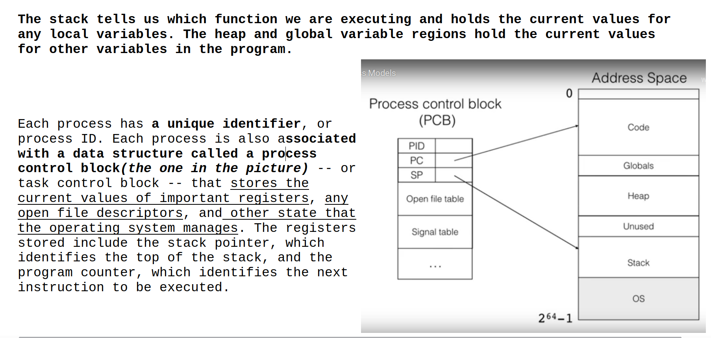
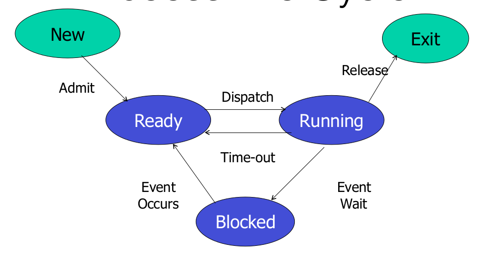
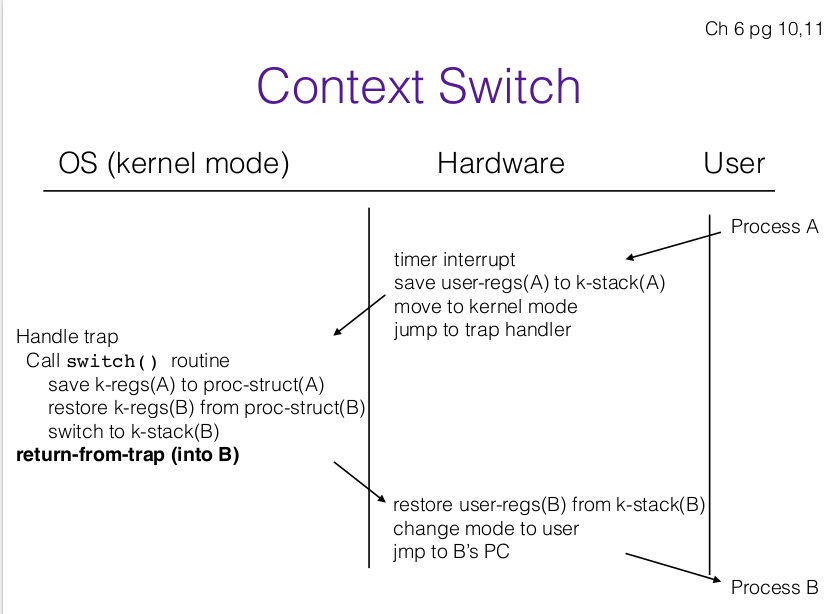

# Processes

## Process Control Block(PCB)

> Contains information related to a process. The information must be saved and updated, as process moves from one state to another(new, read...etc)

* **Process state**: (new, ready, running, waiting, terminated)

* **Program Counter**: address of the next instruction to execute in the process

* **Registers**: the specific registers that are used + **their values** 

* **PID**: ID of a particular process
- **OS resources**: List of open files, network connections, signals, etc

- **Location of PCB**: PCB is kept in memory area that is protected from normal user access. Some OS's place it at beginning of the kernel stack.

## Process Life Cycle

- **Ready**(its waiting for OS to pick it up and move it to running)
  
  When creating a process, before moving it to ready do the following:
  
  1. Create new Process:
     
     * CB, user address space structure
     
     * Allocate memory
  
  2. Load the program executable: **initialize the start state for process**(initialize all necessary variables, create necesssary network connections, db connections, open files, etc)
  
  3. Change state to *ready*

- **Running**(moves to Blocked if waits for some event(I/O, sleep, etc) or Ready if the OS interrupts it)

- **Blocked** (moves to ready when even occurs)

### Managing states

* OS maintains a queue for each state(ready, running, blocked).

* As a process changes its state, its PCB(a pointer to it) is unlinked from one queue and moved to another)

* OS uses a <mark>**context switch**</mark>: a switch the<u>change CPU to another process</u> by:
  
  1. Saving the state of the old process
  
  2. Load saved state for new process

#### Context Switch

##### When does it happen?

* <u>Process calls `yield()`</u>system call *voluntarily*  (occurs rarely)

* <u>Process is blocked</u> when it makes a certain system call

* <u>Timer interrupt handler</u> decides to switch processes

* Notice in hardware it saves the user registers of process A to k-stack of A

* In OS mode: OS first saves the k-regs(think of k-regs as the current registers) to process struct A, and recovers k-regs from proc-struct(B). 

Question: this entire diagram

### Process Creation(In Unix)

* In some systems, children of process inherit permissions of parent process, and other resources 

* After creating a child process (entire new PCB), parent may either wait for it to finish its task or continue in parallel. This depends on the OS and on your hardware. If only 1 CPU is available, OS can only run one of them at the same time. If more are available, OS can choose to run both of them at the same time.  <u>OS decides if parent or child goes first</u>

**`fork()`**:

1. Creates and initializes new PCB

2. Creates new address space

3. Initializes address space with **copy**(note that its a copy, the child does not have a direct relation to the parent. )of entire contents of address space of the parent, i.e it has access to a copy of same data that parent proces has access to

4. Initialize kernel resources to point to **same resources** as used by parent(db connections, open files, etc)

5. Places PCB on **ready queue**.

6. Returns child PID to parent, returns 0 to the child(use return pid to differentiate if you're in the parent or the child.)

### Process Destruction

**`exit()`**

* process voluntarily <u>releases all resources</u>

* `exit()`doesn't free all of the data.
  
  * Must stop process to free everything(i.e needs to context switch to another process)
  
  * A process is a zombie, until its parent collects information it, by calling wait() and catching the `SIGCHILD` signal. Once that happens wait()  returns, process can read information of child and then zombie is completely removed from the memory.
  
  > if a parent process isn’t programmed properly and never calls wait(),its zombie children will stick around in memory until they’re cleaned up.

# 
