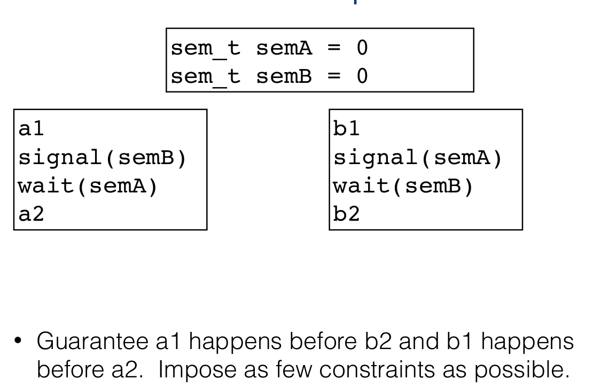

# Semaphores

Abstract data types that provide synchronization. <mark>Semaphore is an alternative to locks.</mark>

<span style="background-color:lime">A semaphore is an integer counting variable that has 2 atomic operations: wait and signal</span>

Semaphores include:

* Integer counter variable(semaphore value), that <u>can only be accessed through 2 atomic operations</u>. <mark>Semaphore value represents number of threads that can pass through wait before it blocks</mark>

* Atomic operation <font color="pink">wait</font>(also called P or decrement).
  
  <font color="salmon"><u>Blocks while semaphore counter <= 0</u> and then decremenets counter</font>

* Atomic operation <font color="pink">signal</font>(also called V or increment)
  
  <font color="salmon"><u>Increment the counter</u>, unblock a waiting thread if there are any.</font>

## Definitions of atomic operations

> these are definitions not implementations

```c
wait(sem){
    while(sem <= 0); // keeps executing as long as sem <= 0.
    sem -- // sem here is 0+, and its decremented.
}

signal(sem){
    sem++;
}
```

## Types of semaphores

* Binary(Mutex) Semaphore is the most common: `count = 0/1`
  
  * Allow **only 1 thread into CS**
  
  * **Mutual exclusion** to critical section

* Counting semaphore(<u>max</u> n  threads allowed in CS, where `count = n`)
  
  * Great for a resource which allows <u>certain kinds of **unsynchronized** concurrent access</u>(e.g reading)

## Atomicity of wait() and signal()

* `wait()` and `signal()` are atomic, meaning that they execute in one go, i.e they will not be interrupted whilst executed.

* To implement them, can use:
  
  * lower-level primitives
  
  * *uniprocessor*: disable interrupts or use  hardware instructions
  
  * *multiprocessor*: use hardware instructions

## Example

```c
typedef struct account {
    double balance;
    semaphore S;
} account_t;

Withdraw(account_t *acct, amt){
    double bal;
    wait(acct->S);
    bal = acct->balance;
    bal = bal - amt;
    acct->balance = bal;
    signal(acct->S);
    return bal;
}
```

> Note: note that we're returning bal instead of acct->balance. This is because we <font color="red">should never touch shared variables outside of a critical section, even for reading, because **they might have already been changed**</font>. Instead return the local variable bal, which you know gives accurate result.

## Semaphors Advantages and disadvantages

* *Advantage*: A semaphor's value can be modified by any thread. In comparison, a lock has an "owner" and <u>can be released only by its owner. 

* *Advantage*: Semaphor can impose an order of behaviour between threads. That's not possible with locks.



> <span style="background-color:lime">If you want to impose order of a first then b, make code `wait` before b on a semaphore that increases ONLY AFTER a is passed.</span>

* *Disadvantage*: Has a conditional variable which is very basic(`if count == 0 -> sleep`). We may want a more complex wait condition.

## Producers/Consumers with Semaphors

```c
//globals
// mutex for writing/reading from bugger
mutex = 1
// semaphor for how many pieces you can read
reads_allowed = 0
// semaphor for how many pieces can be written at the same time
writes_allowed = N

Producer {
    // allow to write only if there is space(i.e if writes_allowed > 0)
    sem_wait(writes_allowed)
 
    // lock buffer
    sem_wait(mutex)
    add_to_buffer()
    sem_signal(mutex)
    
    // send to Consumer message that it's ready to consume +1 piece
    sem_signal(reads_allowed)
}

Consumer{

    // only allow reads if they are possible(there are
    // pieces ready to be consumed)   
    sem_wait(reads_allowed)

    // lock the buffer
    sem_wait(mutex)
    read_from_buffer()
    sem_wait(mutex)
    
    // allow +1 write
    sem_signal(writes_allowed)
}
```


## Reader/Writer with Semaphors

[from Wikipedia](https://en.wikipedia.org/wiki/Readers%E2%80%93writers_problem): Suppose we have a shared memory area (critical section). It is possible to protect the shared data behind a mutual exclusion [mutex](https://en.wikipedia.org/wiki/Mutex "Mutex"), in which case no two threads can access the data at the same time, specifically we don't want a writer and reader accessing it at the same time, or 2 writers, but we're ok with 2 readers accessing it. Reader *R2* should be allowed to read the resource alongside *R1* because reads don't modify data, so **concurrent reads are safe**. This is the motivation for the **first readers-writers problem**, in which the constraint is added that *no reader shall be kept waiting if the share is currently opened for reading.* This is also called **readers-preference**, with its solution:

```c
// Globals
int readcount = 0 // number of readers
semaphore resource = 1;
semaphore mutex = 1;

Writer {
    // can't read and write to data at the same time
    sem_wait(resource);
    write();
    sem_signal(resource);
}

Reader {
    // remember that readcount is a shared variable, therefore multiple variables may be able to modify it at the same time
    sem_wait(mutex)
    reacount +=1;
    if(readcount == 1){ //only need to lock it once, and lock it the first time a reader accesses it
        sem_wait(resource);
    }
    sem_signal(mutex)
    
    read;
    
    sem_wait(mutex)
    readcount -=1;
    if(readcount == 0){// once the last reader inside has finished reading, then you can release the lock and a write or another read can grab it.
        sem_signal(read_or_write)
    }
    sem_signal(mutex)

}
```

<font color="red">TODO</font>: Read [Complete Reader/Writer](https://en.wikipedia.org/wiki/Readers%E2%80%93writers_problem#Third_readers-writers_problem)


