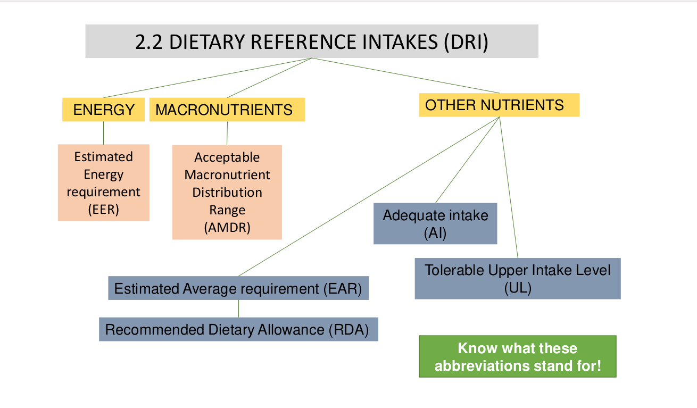
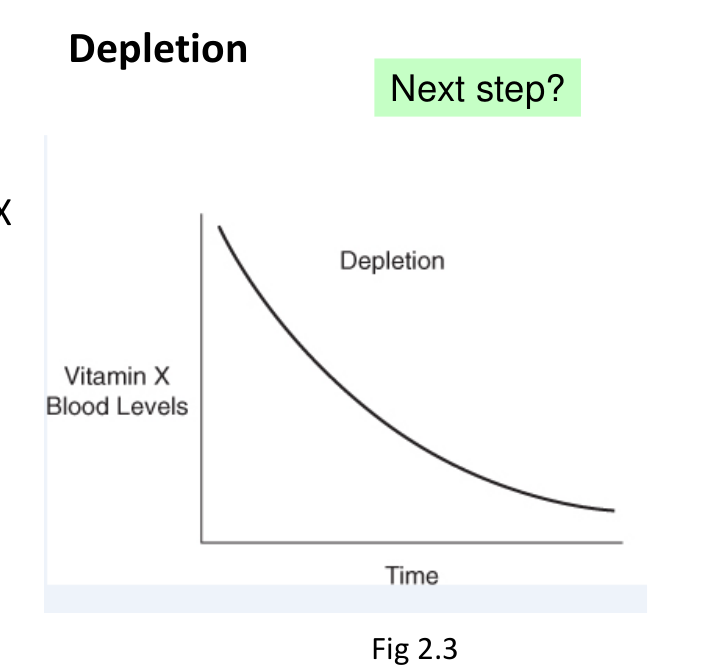
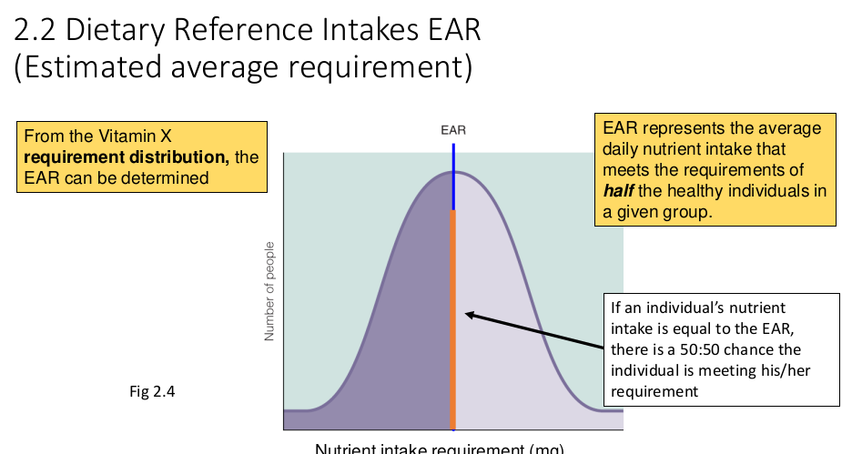
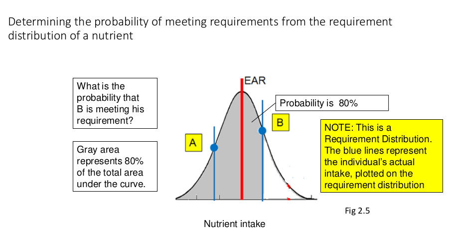
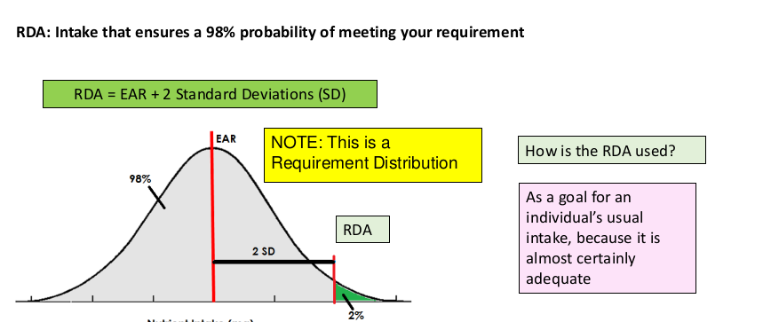
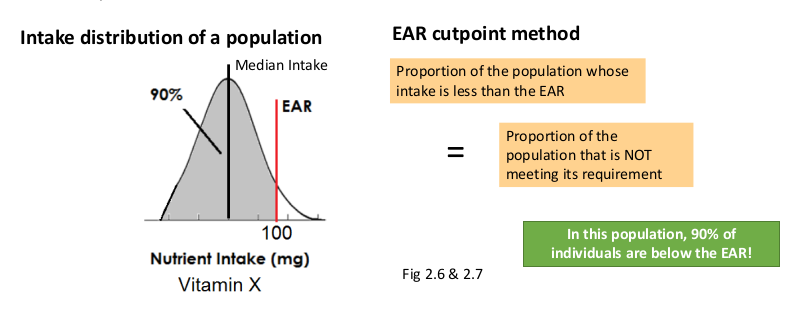
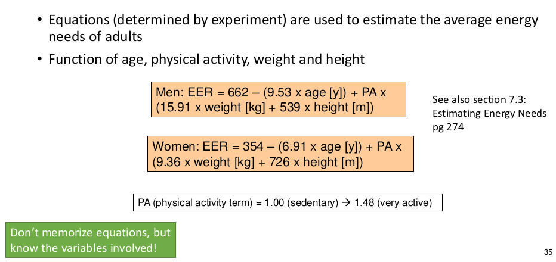

# Chapter 2: Nutrition Guidelines

1. **Nutrient-based approach**: how much of a nutrient is required to maintain health.

2. Food-based approach: types and amounts of foods to maintain health

## Dietary Reference Intake(DRI)

* For planning and assessing diets of **healthy**i ndividuals.

* Values for different life stages and males or females: infants, children, teens, young, middle, older adults, pregnancy/lactation.

### Statistics

<mark>**Estimated Average Requirement(EAR)**: Nutrient intake that meets requirement of 50% of individuals in a group.</mark>

* used to estimate probability that an individual's usual intake is meeting their requirement

* estimate what proportion of a group is meeting their requirement

* Determined by **selecting a biochemical/physiological criterion** that allows you to determine the intake at which an individual's requirement is being met
  
  * e.g Consider Hypothetical Vitamin X. Vitamin X requirement is met when the level of Vitamin X in serum reaches saturation

### Depletion-Repletion experiment

#### Depletion

* Feed a vitamin X-free(i.e no vitamin in this diet) diet

* Track level of vitamin X in blood

* Eventually levels decline until no vitamin X is detected( the individual is deficient)

#### Repletion

* Begin by re-feeding vitamin X

* What happens?
  
  * Blod levels of vitamin X begins to rise
  
  * Eventually each individual reaches an intake where there is no corresponding rise in blood levels(blood is saturated with vitamin X)
  
  * <mark>That intake(where vitamin X concentration stops rising, i.e you reach saturation) is the individual vitamin X requirement</mark>

-----------

### Probability Individuals are meeting their requirements based on the requirement distribution

Normal Distribution: EAR = 100 mg

    100 mg is an estimated Average Requirement, i.e the intake level that meets requirements of 50% of subjects.

* **Nutrient intake**: amount of nutrient consumed, determined by composition of the diet.

* **Nutrient requirement**: experimentally-determined amount required of nutrient to maintain health.

* Can determine EAR from Vitamin X requirement distribution. EAR represents the average daily nutrient intake that meets the requirements of half the healthy individuals in given group.

Area under the curve for a specific individual is the probability that he is meeting the EAR

#### Recommended Dietary Allowance(RDA)

<mark>RDA: EAR + 2 Standard Deviations.</mark>. Esnures 98% probability of meeting your requirement. It is a goal for an individual's usual intake, because **it's almost certainly adequate.**.

------------------------

### Probability proportions of a population are meeting their requirements based on the requirement distribution

**EAR cut point method**: estimates what proportion of a group is meeting their nutrient requirement.

Health Canada Considers a population to have an adequate intake if proportion of population whose intake is below EAR is <mark>10% or less</mark>.

**Adequate intake** - Insufficient data to calculate an EAR. Based on estimate of average nutrient intake by healthy population.

* Example: Recommendations for calcium intake for young infants(0-6 months) = 200mg. *Adequate intake: 200mg*

* If your intake > AI, then intake OK. If intake < AI, intake **may or may not** be OK****

-----

### Tolerable Upper Intake Level (UL)

**Tolerable Upper Intale Level(UL)** Highest level of habitual nutrient intake that is unlikely to pose risk of adverse effect. If UL = 1 g then you can consume 1 g of nutrient daily without adverse effect.

**UL is not a recommended level of intake**. No additional benefit above RDA.

----

### Energy Balance

* **IF** Energy content of food consumer $>$ energy content expanded for metabolism & physical activity  $\rightarrow$ **weight gain**

* **IF** energy content of food consumed $=$  energy content expended for metabolism $\rightarrow$ weight is unchanged

* **IF** energy content of food consumed $<$ energy content expended for metabolism $\rightarrow$ weight loss

<mark>Know how to use the formula!</mark>

