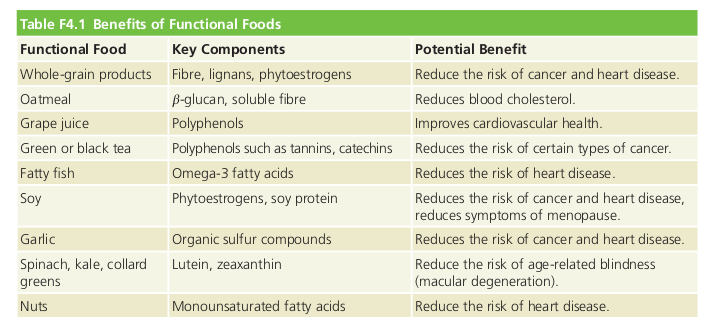
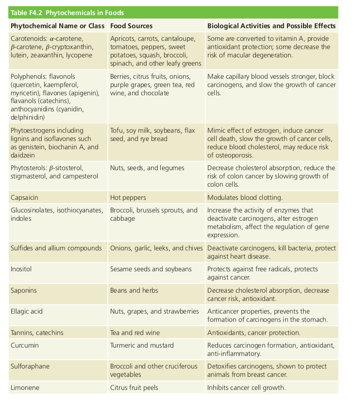
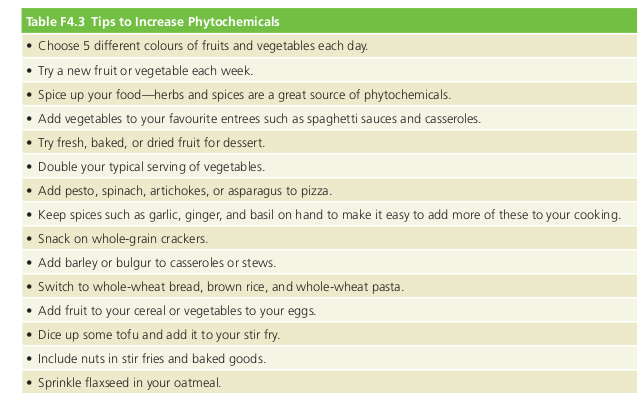
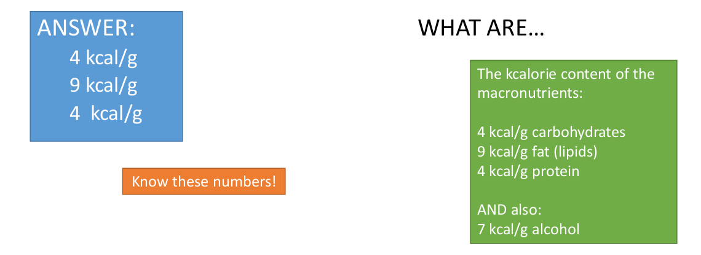
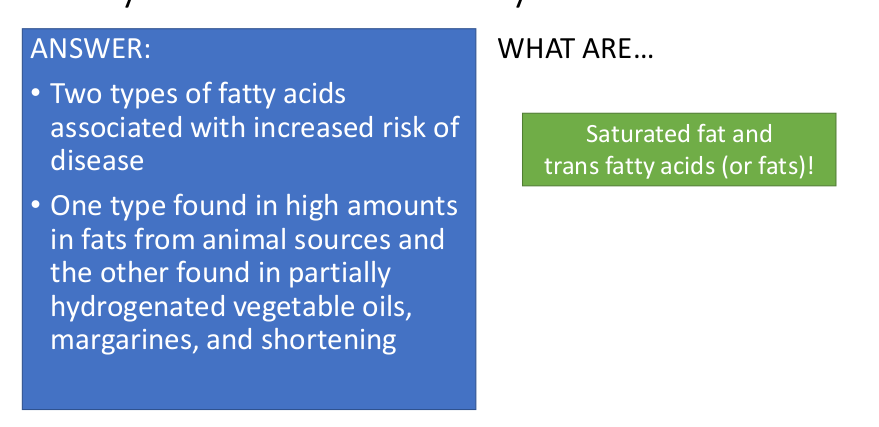
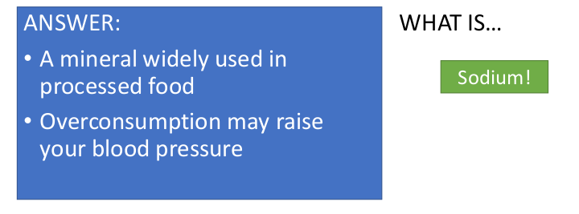
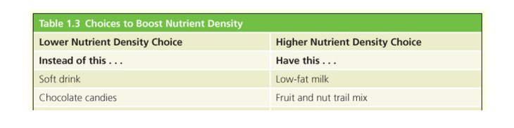

# Focus on Phytochemicals

> Pages(402-408)

## Textbook Readings

**Functional foods**: Demonstrated to have *physiological* benefits and/or reduce the
risk of chronic disease beyond basic nutritional functions.

**Phytochemicals**: Health-promoting substances in **plant foods**
**Zoochemicals**: Health-promoting substances in **animal foods**(i.e meat, dairy, tc)

## Phytochemicals in the canadian diet

*   Include hundreds, thousands of active non-nutritive chemicals found in plants.
*   Some plant chemicals can be toxic(chemicals in rhubarb leaves can cause symptoms including: abdominal pain, nausea, vomiting. Stems have lower toxins and are safe to eat.)

**Phytoestrogens**: (soy) structure similar to 4estrogen and block or mimic estrogen action.
**Phylosterol**: resemble cholesterol in structure, competes with it for absorption from 
gastrointestinal tract and thus reduces the presence of blod cholesterol

### Carotenoids

*   Caretonoid gives fruits/vegetables a yellow-orange colour(carrots, sweet potatoes, acorn
squash, apricots, mangoes). Other caretonoid-containing fruits are masked by green colour of
leafy greens.
*   High intake of carotenoid-containing fruits and vegetables has been associated with
reduced risk of certain cancers, cardiovascular diseases, and age-related eye diseases. Macular
degeneration is Leading cause of blindness in adults over 55. Caretonoids help with that.
cause of blindness in adult
*   Have antioxidant properties, some have vitamin A activity.

### Polyphenols

*   characterized structurally by presence of phenolic rings.
*   Give blue and red colours to blueberries, raspberries, and red cabbage. Give
pale yellow colour to potatoes, onions and orange rind.
*   **Polyphenolic compounds of green tea have been widely studied and may protect against
cancer and heart disease.**
*   Polyphenolic effect of berries may have
proactive effect on cardiovascular health.
*   **Polyphenolic compound in grapes and wine, resveratrol, may be linked to increased longevity and reduced risk of cancer and heart disease**
*   Found in fruits, vegetables, wine, grape juice, chocolate and green tea.

### Phytoestrogen

*   Special **polyophenolic compounds** in plants, that have chemical structures simular to
human hormone estrogen, especially after modification by human gut flora.
*   Believed to <mark>interrupt cancer developemnt</mark> and affect health by binding
to estrogen receptors on cells and blocking or altering estrogen functions.
*   Include **isoflavones** which are found in soybeans, flaxseed, and barley, and may
protect against cancer and osteoporosis.

### Indoles, Isiothiocyanates, and Alliums

#### Cruciferous vegetables

* **cruciferous** vegetables such as broccoli, cauliflower, brussel sprouts, cabbage,
and greens like mustard, collards are a good source of sulfur-containing phytochemicals.
* **Stimulate activity of enzymes that detoxify carcinogens**

#### Sulfur compounds

* Garlic, onions, leeks, chives, and shallots contain sulfur compounds. 
* Boost activity of cancer-destroyng enzyme systems, protect against oxidative damage,
defend against heart disease by lowering blood cholesterol, blood pressure, and platelet activity.
* Prevents bacteria in the gut from converting nitrates into nitrites, which can form carcinogens.

### Chocolate

+   Constains chemical compounds that can give a mood boost. Causes brain to produce
natural opiates, which dull pain and increase well-being.
+   Can mimic effects of THC - causing a chocolate high.
+   Has compounds which raise blood pressure and blood sugar, which can incresae alertness
and contenment. 
+   Contains caffeeine and related compounds that make us feel more alert.
+   Dark chocolate contains polyphenolic antixodiants, which may protect against
heart disease and other health problems. COntains more antioxidants than red wine
or blueberries.
+   POlyphenols in dark chocolate improve arterial function, lower blood pressure,
and improve insulin sensitivity.
------------------------------
-   Added sugar and cocoa butter dilutes concentration of phytochemicals, and increases
caloric content.
-   Half of the fat in cocoa butter is saturated far, which may increase the risk of
cardiovascular disease.
*   Light chocolate doesn't contain as many **phytochemicals** as dark chocolate, and 
white chocolate contains **no phytochemicals** at all, since it doesn't have any cocoa.
*   **Dark chocolate, then, made from 70% or more cocoa, provides minerals
and antioxidants that may reduce disease risk. If additional research confirms
this beneficial effect, then dark chocolate would qualify as a functional
food.**

### Choosing a Phytochemical-rich Diet

*   Difficult to make quantitative recommendations for intake of specific phytochemicals,
since
*   Choose diet based on plant foods. Impact of the total diet is more significant than that of any
single phytochemical.
*   A diet high in plant sterols, soy, almonds, and foods like oats, barley, psyllium, okra
and eggplant(high in soluble fibre) lowered cholesterol as much as prescription medication.

* **Eat green and orange vegetables daily**

### Grains

*   Grain contains as many if not more phytochemicals and antioxidantas than fruits and vegetables.
*   Whole grains are rich in antioxidant phytochemicals, 

### Plant Proteins

*   Phytochemical-rich soybeans and flaxseeds are great sources of protein, and legumes like
nuts, and seeds are high-protein foods that make important fibre and phytochemical contributions.
*   Recommend to choose beans, peas, nuts, and seeds more often.

--------------------------------------

## Lecture

## Slides

