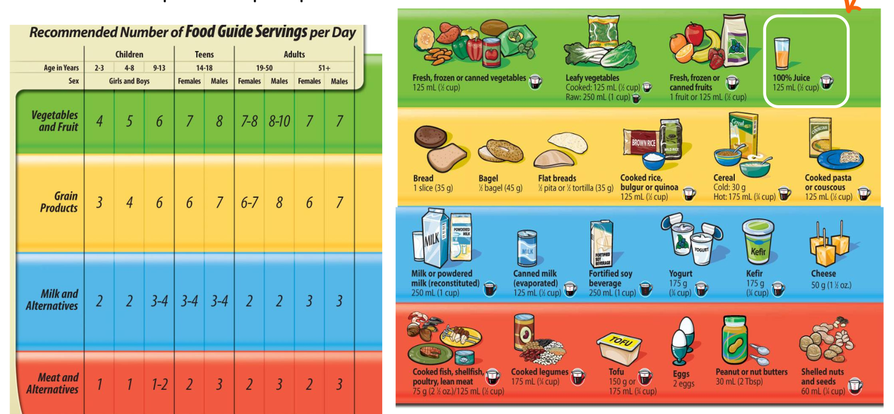
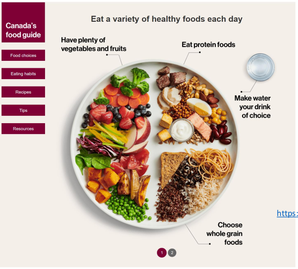

# Canada's Food Guide

## Controversies about Canada's Food Guide 2007

1. Not enough emphasis on whole grains

2. Food groups may be industry-influenced(Beef and dairy industry)

3. $Includes$ fruit juice

4. Emphasizes total fat intake instead of type of fat. Poor messaging on fat: types of fat(saturated vs unsaturated) are actually more important than total fat intake

5. Not enough emphasis on **whole grains**

6. Uses prescriptive serving sizes. Consumers prefer proportions instead of absolute amounts.   
   

2. ## New Canadian FoodGuide

### 3 main ideas

1. Nutritious foods are the foundation for healthy living.
   * Vegetables, fruits, whole grains, and protein should be consumed regularly. Among protein foods, consume plant-based more often.
   * Protein foods include: legumes, nuts, seeds, tofu, fortified soy beverages, fish, shellfish, eggs, poultry, lean red meat, lower fat milk, lower fat yogurts, lower fat kefir, cheeses lower in fat and sodium
   * <mark>Foods that contain mostly unsaturated fats should replace foods that contain mostly saturated fats</mark>.
   * Water should be the beverage of choice. 
2. Processed or prepared foods and beverages contribute to **excess sodium**, **free sugars**, or **saturated fat** undermine healthy eating and should not be
   consumed regularly.
3. Food skills are needed to navigate the complex food environment and support
   healthy eating.
   * **Food labels** should be promoted as a tool to help Canadians make informed food choices
   * **Cooking** and food preparation using nutritious foods should be promoted as a practical way to support heatlhy eating.

## Food Choices Key Points

1. Eat vegetables and fruits
2. Eat whole grains
3. Choose protein foods that come from plants **more often**
4. Choose foods with **healthy fats** instead of **saturated fats**
5. **Limit highly processed foods**. 
6. <mark>Prepare meals and snacks with ingredients that have little to **no sodium, sugars or saturated fats**</mark>
7. Choose healthier options when eating out.
8. Make water your drink of choice
9. Use food labels
10. Be aware that food marketing can influence your choices

### Vegetables:

* Vegetables and fruits have important nutrients such as: fibre, vitamins, minerals.
* <mark>Include **half** of vegetables and fruits in your meals.</mark>
* Replace juice with water. Fruit juice and fruit juice concentrates are high in sugars.
* Eating variety of vegetables and fruits *may lower risk of heart disease*.
* How to eat more vegetables
  * Wash, chop and refrigerate extra vegetables so you have some ready for next day
  * Use pre-bagged vegetables that can be quickly tossed in a salad, stir-fry or casserole
  * Serve raw vegetables with meals

### Whole grain foods

* Whole grain foods have important nutrients such as: fibre, vitamins, minerals.
* Whole grain are a healthier choice than refined grains because they include ALL PARTS of the grain.
* Whole grain have more fibre than refined grains. Eating foods higher in fibre can lower your risk of:
  * Stroke
  * Colon Cancer
  * Heart disease
  * Type 2 diabetes
* Examples of whole grain: farro, oats, quinoa, brown rice, whole grain pasta, whole grain bread.
* <mark>Read ingredient list and choose foods that have the word "whole grain"</mark> 

### Protein Foods

* Have important nutrients such as: protein, vitamins, minerals.

* **Most often Choose proteins that come from plants**. They can provide more fibre and less saturated fat than other types of protein foods. 

* Eat protein foods such as: eggs, **lean meats**, nuts and seeds, fish and shellfish, **lower fat dairy products**, beans, peas and lentils, soy beverages, tofu

### Healthy Fats

* Choosing **fats with healthy fats instead of saturated fats can lower your risk of heart disease**. Heart disease is 1 of the leading causes of death in Canada.

* The type of fat you eat over time is more important for health than the total amount of fat you eat

* Foods containing saturated fats: **Fatty meats**, h**igh fat dairy products**, **highly processed foods**, tropical oils like palm and coconut, **ice cream**,  deep fried foods like **French Fries**, **pizza** and other foods containing lots of cheese

* Choose lean cuts of meat and **skinless** poultry.

* **Trim off as much of the visible fat as possible**

* Drain fat from cooked ground meat.

### Drinks

* Make **water the drink of your choice**

* Healthy drink options other than water can include: 

### ### Limiting highly processed foods

> Processed or prepared foods and drinks that <mark>add excess sodium, sugars, or saturated fat to the diets of Canadians.</mark>

Highly processed foods include:

* **Sugary Drinks, chocolates and candies, ice cream**

* Fast foods like **French Fries and burgers**

* Frozen entrees like pasta dishes and** pizzas**

* Bakery products like **muffins, buns and cakes**
