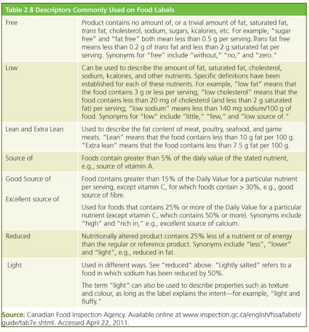

# Food Labels(PP): *How to read and Understand Food labels*

## Requirements on a food label today

1. Product Name

2. Product **amount**

3. Product manufacturer or distributor

4. **Best before date** of perishable items

5. List of **ingredients**

6. **Nutrition facts** table

**Use food labels to select foods low in <mark>Saturated fat, sugars, sodium and kcalories</mark>**

-----------------------

## Daily Value

* Standard nutrient amount

* %DV indicates how much of nutrient is in a food out of how much you need in a day.

**Analyzing nutrition facts with Daily Value**

* <=5% DV(daily value )is a little.

* 5% - 15% DV is decent

* 15%+ DV is **a lot** 

### Nutrients to limit

- <mark>(Fat, Sat/Trans fat, Sodium, Sugars)</mark>

- Avoid more than 15%

- Aim for less than 5%

- All nutrients with a mandatory Daily Value should be limited(**Fat, Saturated & Trans Fats, Sugars, Sodium**)

### Nutrients to get enough

* <mark>Vitamin A, Vitamin C, Calcium, Iron</mark>

* Avoid less than 5% - too little

* Aim for a lot : >= 15%

----------

## Ingredients List

* In Canada, you can add a nutrient content claim (*product contains specific nutrient*) without approval from Health Canada

* In Canada you can add a nutrient function claim(*nutrient does specific thing*) without approval from Health Canada

* Disease reduction claim(including therapeutic claims) require prior approval from Health Canada

### Nutrient Content Claims

* `Source of` contains 5% source of DV.

* `Good source of` contains 15% of DV.

* `Excellent source of` contains 25% of DV except for Vitamin C, where it must contain 50% or more. Synonyms: *rich in*, *high*

* `Free` means contains no amount of, or **trivial amount of**  saturated fat, trans fat, cholesterol, sodium, sugars, kcalopries, etc. Trans fat free means less than 0.2g of trans fat + less than 2g of saturated fat per serving.

### Nutrient Function Claims

* Foods must contain **at least 5% of DV**

* Claim must mention **food + nutrient**

### Health CLaims Disease Reduction claims

* Must request permission from Health Canada

* <mark>Scientific evidence must strongly support the claim</mark>

-------

## How to use NFT(Nutrition Facts Table) to Compare products
